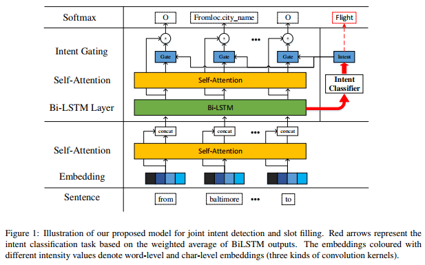

# Slot-Filling-and-Intention-Prediction-in-Paper-Translation
+ **内容**：槽填充、意图预测（口语理解）论文整理和中文翻译。Slot filling and intent prediction paper collation and Chinese translation. 
+ **论文任务信息汇总**：包含所有已经翻译和正在翻译论文
+ **例子**：下面以 A Self-Attentive Model with Gate Mechanism for Spoken Language Understanding 为例说明翻译格式，更多内容见[槽填充和意图识别任务相关论文发展脉络.md](https://github.com/yuanxiaosc/Slot-Filling-and-Intention-Prediction-in-Paper-Translation/blob/master/%E6%A7%BD%E5%A1%AB%E5%85%85%E5%92%8C%E6%84%8F%E5%9B%BE%E8%AF%86%E5%88%AB%E4%BB%BB%E5%8A%A1%E7%9B%B8%E5%85%B3%E8%AE%BA%E6%96%87%E5%8F%91%E5%B1%95%E8%84%89%E7%BB%9C.md)

> 一般会经常在[博客](https://yuanxiaosc.github.io/categories/%E8%AE%BA%E6%96%87/%E5%8F%A3%E8%AF%AD%E7%90%86%E8%A7%A3/)中更新此内容，等到收集到一定数量才在这里更新！

## 最新槽填充和意图识别任务相关论文

https://paperswithcode.com/task/slot-filling
https://paperswithcode.com/task/intent-classification
https://github.com/AtmaHou/Task-Oriented-Dialogue-Dataset-Survey

## 论文任务信息汇总

|论文标题|时间|领域预测|意图预测|槽填充|
|-|-|-|-|-|
|[Deep belief nets for natural language call-routing](https://www.cs.toronto.edu/~hinton/absps/callrouting.pdf)|2011||√||
|[Towards Deeper Understanding Deep Convex Networks for Semantic Utterance Classification](https://www.microsoft.com/en-us/research/publication/towards-deeper-understanding-deep-convex-networks-for-semantic-utterance-classification/)|2012|√|||
|[Towards Deeper Understanding Deep Convex Networks for Semantic Utterance Classification](https://www.microsoft.com/en-us/research/publication/towards-deeper-understanding-deep-convex-networks-for-semantic-utterance-classification/)|2012||√||
|[Use of Kernel Deep Convex Networks and End-To-End Learning for Spoken Language Understanding](https://www.microsoft.com/en-us/research/publication/use-of-kernel-deep-convex-networks-and-end-to-end-learning-for-spoken-language-understanding/)|2012||√||
|[Deep belief network based semantic taggers for spoken language understanding](https://www.microsoft.com/en-us/research/publication/deep-belief-network-based-semantic-taggers-for-spoken-language-understanding/)|2013|||√|
|[Recurrent Neural Networks for Language Understanding](https://www.microsoft.com/en-us/research/publication/recurrent-neural-networks-for-language-understanding/)|2013|||√|
|[Investigation of Recurrent-Neural-Network Architectures and Learning Methods for Spoken Language Understanding](https://www.microsoft.com/en-us/research/publication/investigation-of-recurrent-neural-network-architectures-and-learning-methods-for-spoken-language-understanding/)|2013|||√|
|[Convolutional neural network based triangular crf for joint intent detection and slot filling](https://ieeexplore.ieee.org/document/6707709)|2013||√|√|
|[Application of deep belief networks for natural language understanding](https://ieeexplore.ieee.org/document/6737243)|2014||√||
|[Joint semantic utterance classification and slot filling with recursive neural networks](https://www.microsoft.com/en-us/research/wp-content/uploads/2014/12/RecNNSLU.pdf)|2014||√|√|
|[Recurrent neural network and LSTM models for lexical utterance classification](https://www.microsoft.com/en-us/research/publication/recurrent-neural-network-and-lstm-models-for-lexical-utterance-classification/)|2015||√||
|[Multi-Domain Joint Semantic Frame Parsing using Bi-directional RNN-LSTM](https://www.csie.ntu.edu.tw/~yvchen/doc/IS16_MultiJoint.pdf)|2016|√|√|√|
|[Attention-Based Recurrent Neural Network Models for Joint Intent Detection and Slot Filling](https://arxiv.org/abs/1609.01454v1)|2016||√|√|
|[Multi-Domain Joint Semantic Frame Parsing using Bi-directional RNN-LSTM](https://www.csie.ntu.edu.tw/~yvchen/doc/IS16_MultiJoint.pdf)|2016||√|√|
|[Slot-Gated Modeling for Joint Slot Filling and Intent Prediction](http://www.aclweb.org/anthology/N18-2118)|2018||√|√|
|[Unsupervised Transfer Learning for Spoken Language Understanding in Intelligent Agents](https://arxiv.org/abs/1811.05370)|2018||√|√|
|[Joint Slot Filling and Intent Detection via Capsule Neural Networks](https://arxiv.org/abs/1812.09471)|2018||√|√|

## 2018 A Self-Attentive Model with Gate Mechanism for Spoken Language Understanding
**Abstract**
Spoken Language Understanding (SLU), which typically involves intent determination and slot filling, is a core component of spoken dialogue systems. Joint learning has shown to be effective in SLU given that slot tags and intents are supposed to share knowledge with each other. However, most existing joint learning methods only consider joint learning by sharing parameters on surface level rather than semantic level. In this work, we propose a novel self-attentive model with gate mechanism to fully utilize the semantic correlation between slot and intent. Our model first obtains intent-augmented embeddings based on neural network with self-attention mechanism. And then the intent semantic representation is utilized as the gate for labelling slot tags. The objectives of both tasks are optimized simultaneously via joint learning in an end-to-end way. We conduct experiment on popular benchmark ATIS. The results show that our model achieves state-of-the-art and outperforms other popular methods by a large margin in terms of both intent detection error rate and slot filling F1-score. This paper gives a new perspective for research on SLU.

**摘要**
口语理解（SLU）通常涉及意图确定和插槽填充，是口语对话系统的核心组成部分。鉴于插槽标签和意图应该彼此分享知识，联合学习已经证明在SLU中是有效的。然而，大多数现有的联合学习方法仅考虑通过在表面水平而不是语义水平上共享参数来进行联合学习。在这项工作中，我们提出了一种新的具有门机制的自注意力模型，以充分利用槽和意图之间的语义相关性。我们的模型首先基于具有自注意力机制的神经网络获得意图增强嵌入。然后将意图语义表示用作标记槽标签时的门。这两项任务的目标通过端到端的联合学习同时优化。我们在流行的基准ATIS上进行实验。结果表明，我们的模型在意图检测错误率和槽填充F1得分方面都达到了最先进的水平，并且在很大程度上优于其他流行方法。本文为SLU的研究提供了新的视角。

### Introduction
One long-term goal in artificial intelligence field is to build an intelligent human-machine dialogue system, which is capable of understanding human’s language and giving smooth and correct responses. A typical dialogue system is designed to execute the following components: (i) automatic speech recognition converts a spoken query into transcription, (ii) spoken language understanding component analyzes the transcription to extract semantic representations, (iii) dialogue manager interprets the semantic information and decides the best system action, according to which the system response is further generated either as a natural language  output(Jurafsky, 2000).

In this paper, we focus on spoken language understanding which is a core component of a spoken dialogue system. It typically involves two major tasks, intent determination and slot filling. Intent determination aims to automatically identify the intent of the user as expressed in natural language. Slot filling aims to extract relevant semantic constituents from the natural language sentence towards achieving a goal.

Usually, intent detection and slot filling are carried out separately. However, separate modeling of these two tasks is constrained to take full advantage of all supervised signals. Joint learning of intent detection and slot filling is worthwhile for three reasons. Firstly, the two tasks usually appear simultaneously in SLU systems. Secondly, the information of one task can be utilized in the other task to promote each other and a joint prediction can be made (Zhang and Wang, 2016). For example, if the intent of a utterance is to find a flight, it is likely to contain the departure and arrival cities, and vice versa. Lastly, slot tags and intents, as semantics representations of user behaviours, are supposed to share knowledge with each other.

Recently, joint model for intent detection and slot filling has achieved much progress. (Xu and Sarikaya, 2013) proposed using CNN based triangular CRF for joint intent detection and slot filling. (Guo et al., 2014) proposed using a recursive neural network that learns hierarchical representations of the input text for the joint task. (Liu and Lane, 2016b) describes a recurrent neural network (RNN) model that jointly performs intent detection, slot filling and language modeling. The neural network models keep updating the intent prediction as word in the transcribed utterance arrives and uses it as contextual features in the joint model.

In this work, we propose a novel model for joint intent determination and slot filling by introducing self-attention and gating mechanism. Our model can fully utilize the semantic correlation between slot and intent. To the best of our knowledge, this is the first attempt to utilize intent- augmented embedding as a gate to guide the learning of slot filling task. To fully evaluate the efficiency of our model, we conduct experiment on Airline Travel Information Systems (ATIS) dataset (Hemphill et al., 1990), which is popularly used as benchmark in related work. And empirical results show that our independent model outperforms the previous best result by 0.54% in terms of F1-score on slot filling task, and gives excellent performance on intent detection task. Our joint model further promotes the performance and achieves state-of-the-art results on both tasks.
The rest of our paper is structured as follows: Section 2 discusses related work, Section 3 gives a detailed description of our model, Section 4 presents experiments results and analysis, and Section 5 summarizes this work and the future direction.

### 介绍
人工智能领域的一个长期目标是建立一个智能的人机对话系统，它能够理解人类的语言，并提供顺畅和正确的反应。 典型的对话系统被设计为执行以下组件：（i）自动语音识别将口头查询转换为录音文本，（ii）口语理解组件分析录音文本以提取语义表示，（iii）对话管理器解释语义信息和决定最佳系统动作，根据该动作，系统进一步生成自然语言相应（Jurafsky，2000）。

在本文中，我们关注口语理解，这是口语对话系统的核心组成部分。 它通常涉及两个主要任务，即意图确定和槽填充。 意图确定旨在自动识别用自然语言表达的用户意图。 槽填充旨在从自然语言句子中提取相关的语义成分以实现目标。

通常，意图检测和槽填充是分开进行的。 然而，这两个任务的单独建模受限于充分利用所有监督信号。 意图检测和插槽填充的联合学习是值得的，原因有三个。 首先，这两个任务通常同时出现在SLU系统中。 其次，一个任务的信息可以用于另一个任务中以相互促进，并且可以进行联合预测（Zhang和Wang，2016）。 例如，如果话语的意图是发现航班查询，则可能包含出发和到达城市，反之亦然。 最后，作为用户行为的语义表示的槽标记和意图应该彼此共享知识。

最近，用于意图检测和槽填充的联合模型已经取得了很大进展。 （Xu和Sarikaya，2013）提出使用基于CNN的三角形CRF进行关节意图检测和槽填充。 （Guo et al。，2014）提出使用递归神经网络来学习联合任务的输入文本的层次表示。 （Liu and Lane，2016b）描述了一种递归神经网络（RNN）模型，它共同执行意图检测，槽填充和语言建模。 当语音文本中的单词到达时，神经网络模型不断更新意图预测，并将其用作联合模型中的上下文特征。

在这项工作中，我们通过引入自注意力机制和门控机制提出了一种新的联合意图确定和槽填充模型。我们的模型可以充分利用插槽和意图之间的语义关联。据我们所知，这是第一次尝试利用意图增强嵌入作为指导学习插槽填充任务的门。为了充分评估我们模型的效果，我们对航空旅行信息系统（ATIS）数据集（Hemphill等，1990）进行了实验，该数据集被广泛用作相关工作的基准。实证结果表明，我们的独立模型在插槽填充任务的F1得分方面优于先前的最佳结果0.54％，并且在意图检测任务方面表现出色。我们的联合模型进一步提升了性能，并在这两项任务中实现了最先进的结果。

本文的其余部分结构如下：第2节讨论相关工作，第3节详细描述了我们的模型，第4节介绍了实验结果和分析，第5节总结了这项工作和未来的方向。

### Related Work
There is a long research history for spoken dialogue understanding, which emerged in the 1990s from some call classification systems (Gorin et al., 1997) and the ATIS project. In this section, we describe some typical works on intent classification and slot-filling, which are both core tasks of SLU (De Mori, 2007).

For intent detection task, the early traditional method is to employ n-grams as features with generic entities, such as locations and dates (Zhang and Wang, 2016). This type of method is restricted to the dimensionality of the input space. Another line of popular approaches is to train machine learning models on labeled training data (Young, 2002; Hahn et al., 2011). For example, SVM (Haffner et al., 2003) and Adaboost (Schapire and Singer, 2000) have been explored to improve intent detection. Approaches based on neural network architecture have shown good performance on intent detection task. Deep belief networks (DBNs) have been first used in call routing classification (Deoras and Sarikaya, 2013). More recently, RNNs have shown excellent performance on the intent classification task (Ravuri and Stol- cke, 2015).

For slot-filling task, traditional approaches are based on conditional random fields (CRF) architecture, which has strong ability on sequence labelling (Raymond and Riccardi, 2007). Recently, models based on neural network and its extensions have shown excellent performance on the slot filling task and outperform traditional CRF models. For example, (Yao et al., 2013) proposed to take words as input in a standard recurrent neural network language model, and then to predict slot labels rather than words on the output side. (Yao et al., 2014b) improved RNNs by using transition features and the sequence-level optimization criterion of CRF to explicitly model dependencies of output labels. (Mesnil et al., 2013) tried bi-directional and hybrid RNN to investigate using RNN for slot filling. (Yao et al., 2014a) introduced LSTM architecture for this task and obtained a marginal improvement over RNN. Besides, following the success of attention based models in the NLP field, (Simonnet et al., 2015) applied the attention-based encoder-decoder to the slot filling task, but without LSTM cells.

Recently, there has been some work on learning intent detection and slot filling jointly exploited by neural networks. Slot labels and intents, as semantics of user behaviors, are supposed to share knowledge with each other. (Guo et al., 2014) adapted recursive neural networks (RNNs) for joint training of intent detection and slot filling. (Xu and Sarikaya, 2013) described a joint model for intent detection and slot filling based on convolutional neural networks (CNN). The proposed architecture can be perceived as a neural network version of the triangular CRF model (Tri- CRF). (Hakkani-Tur et al. ¨ , 2016) proposed a single recurrent neural network architecture that integrates the three tasks (domain detection, intent detection and slot filling for multiple domains) in a model. (Liu and Lane, 2016a) proposed an attention-based neural network model for joint intent detection and slot filling. Their joint model got the best performance of 95.98% slot filling F1-score and 1.57% intent error rate in the ATIS dataset.

Despite the great progress those methods have achieved, it is still a challenging and open task for intent detection and slot filling. Therefore, we are motivated to design a powerful model, which can improve the performance of SLU systems.

### 相关工作
对于口语对话理解有着悠久的研究历史，这种理解在20世纪90年代由一些呼叫分类系统（Gorin等，1997）和ATIS项目出现。 在本节中，我们描述了一些关于意图分类和槽填充的典型工作，它们都是SLU的核心任务（De Mori，2007）。

对于意图检测任务，早期的传统方法是使用n-gram作为通用实体的特征，例如位置和日期（Zhang和Wang，2016）。 这种方法仅限于输入空间的维度。 另一种流行的方法是在标记的训练数据上训练机器学习模型（Young，2002; Hahn等，2011）。 例如，已经探索了SVM（Haffner等人，2003）和Adaboost（Schapire和Singer，2000）以改进意图检测。 基于神经网络架构的方法已经在意图检测任务上表现出良好的性能。 深度信任网络（DBN）首先被用于呼叫路由分类（Deoras和Sarikaya，2013）。 最近，RNN在意图分类任务中表现出色（Ravuri和Stolke，2015）。

对于槽填充任务，传统方法基于条件随机场（CRF）架构，其具有强大的序列标记能力（Raymond和Riccardi，2007）。最近，基于神经网络及其扩展的模型在插槽填充任务中表现出优异的性能，并且优于传统的CRF模型。例如，（Yao et al。，2013）提出在标准递归神经网络语言模型中将单词作为输入，然后预测槽标签而不是输出侧的单词。 （Yao等，2014b）通过使用录音文本和CRF的序列级优化标准来明确地模拟输出标签的依赖性来改进RNN。 （Mesnil等，2013）尝试使用双向和混合RNN来研究使用RNN进行槽填充。 （Yao et al。，2014a）为此任务引入了LSTM架构，并获得了对RNN的微小改进。此外，随着NLP领域基于注意力的模型的成功，（Simonnet等，2015）将基于注意力的编码器-解码器应用于槽填充任务，但没有LSTM单元。

最近，在神经网络共同利用的学习意图检测和槽填充方面已经有了一些工作。作为用户行为的语义，槽标签和意图应该彼此共享知识。 （Guo et al。，2014）改进了递归神经网络（RNN），用于意图检测和槽填充的联合训练。 （Xu和Sarikaya，2013）描述了基于卷积神经网络（CNN）的意图检测和槽填充的联合模型。所提出的架构可以被视为三角形CRF模型（Tri-CRF）的神经网络版本。 （Hakkani-Tur等人，2016）提出了一种单一的递归神经网络架构，它将模型中的三个任务（域检测，意图检测和多个域的槽填充）集成在一起。 （Liu and Lane，2016a）提出了一种基于注意力的神经网络模型，用于关节意图检测和槽填充。他们的联合模型在ATIS数据集中获得了95.98％槽位填充F1得分和1.57％意向错误率的最佳表现。

尽管这些方法已经取得了很大的进展，但对于意图检测和插槽查找仍然是一项具有挑战性和开放性的任务。因此，我们有动机设计一个强大的模型，以提高SLU系统的性能。

**Self-Attention_with_Gate_Mechanism**

|标题|说明|时间|
|-|-|-|
|[A Self-Attentive Model with Gate Mechanism for Spoken Language Understanding](http://aclweb.org/anthology/D18-1417)|论文原文||
