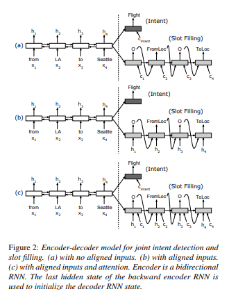
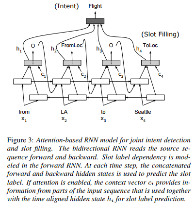
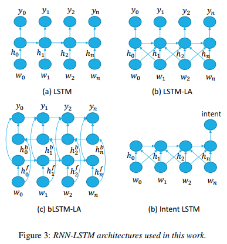
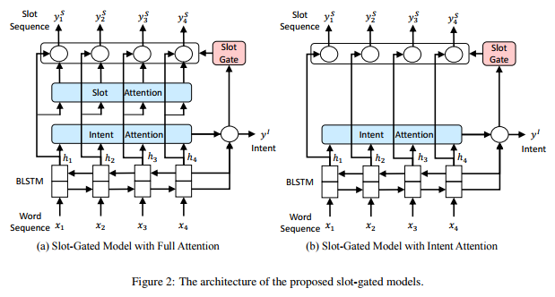
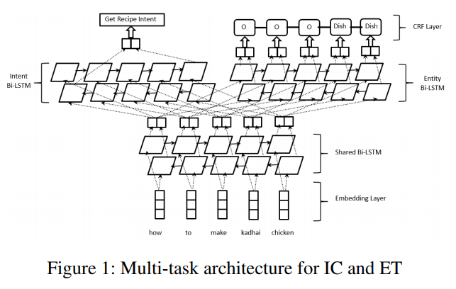
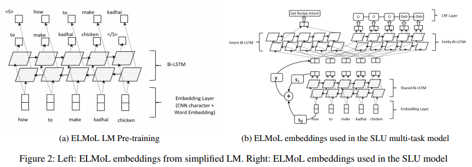
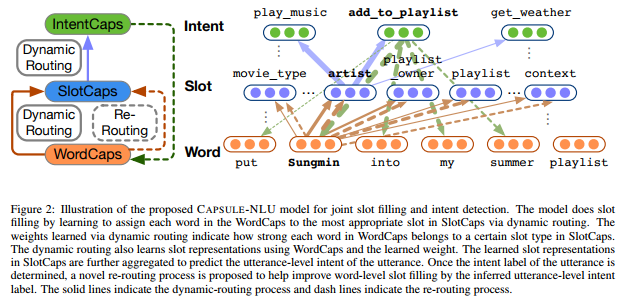

## GitHub 槽填充和意图识别任务仓库
### [slot-filling](https://github.com/topics/slot-filling)
|标题|说明|时间|
|-|-|-|
|[snips-nlu](https://github.com/snipsco/snips-nlu)|Snips NLU（自然语言理解）是一个Python库，允许解析用自然语言编写的句子并提取结构化信息。**主要针对意图识别和槽填充任务，结合了深度学习和特征工程方法，且有对智能家居领域的应用示例**||
|[DeepPavlov](https://github.com/deepmipt/DeepPavlov)|用于深度学习端到端对话系统和聊天机器人的开源库。||

### [intent](https://github.com/topics/intent)

## 最新槽填充和意图识别任务相关论文

https://paperswithcode.com/task/slot-filling
https://paperswithcode.com/task/intent-classification
https://github.com/AtmaHou/Task-Oriented-Dialogue-Dataset-Survey

## 论文任务信息汇总

|论文标题|时间|领域预测|意图预测|槽填充|
|-|-|-|-|-|
|[Deep belief nets for natural language call-routing](https://www.cs.toronto.edu/~hinton/absps/callrouting.pdf)|2011||√||
|[Towards Deeper Understanding Deep Convex Networks for Semantic Utterance Classification](https://www.microsoft.com/en-us/research/publication/towards-deeper-understanding-deep-convex-networks-for-semantic-utterance-classification/)|2012|√|||
|[Towards Deeper Understanding Deep Convex Networks for Semantic Utterance Classification](https://www.microsoft.com/en-us/research/publication/towards-deeper-understanding-deep-convex-networks-for-semantic-utterance-classification/)|2012||√||
|[Use of Kernel Deep Convex Networks and End-To-End Learning for Spoken Language Understanding](https://www.microsoft.com/en-us/research/publication/use-of-kernel-deep-convex-networks-and-end-to-end-learning-for-spoken-language-understanding/)|2012||√||
|[Deep belief network based semantic taggers for spoken language understanding](https://www.microsoft.com/en-us/research/publication/deep-belief-network-based-semantic-taggers-for-spoken-language-understanding/)|2013|||√|
|[Recurrent Neural Networks for Language Understanding](https://www.microsoft.com/en-us/research/publication/recurrent-neural-networks-for-language-understanding/)|2013|||√|
|[Investigation of Recurrent-Neural-Network Architectures and Learning Methods for Spoken Language Understanding](https://www.microsoft.com/en-us/research/publication/investigation-of-recurrent-neural-network-architectures-and-learning-methods-for-spoken-language-understanding/)|2013|||√|
|[Convolutional neural network based triangular crf for joint intent detection and slot filling](https://ieeexplore.ieee.org/document/6707709)|2013||√|√|
|[Application of deep belief networks for natural language understanding](https://ieeexplore.ieee.org/document/6737243)|2014||√||
|[Joint semantic utterance classification and slot filling with recursive neural networks](https://www.microsoft.com/en-us/research/wp-content/uploads/2014/12/RecNNSLU.pdf)|2014||√|√|
|[Recurrent neural network and LSTM models for lexical utterance classification](https://www.microsoft.com/en-us/research/publication/recurrent-neural-network-and-lstm-models-for-lexical-utterance-classification/)|2015||√||
|[Multi-Domain Joint Semantic Frame Parsing using Bi-directional RNN-LSTM](https://www.csie.ntu.edu.tw/~yvchen/doc/IS16_MultiJoint.pdf)|2016|√|√|√|
|[Attention-Based Recurrent Neural Network Models for Joint Intent Detection and Slot Filling](https://arxiv.org/abs/1609.01454v1)|2016||√|√|
|[Multi-Domain Joint Semantic Frame Parsing using Bi-directional RNN-LSTM](https://www.csie.ntu.edu.tw/~yvchen/doc/IS16_MultiJoint.pdf)|2016||√|√|
|[Slot-Gated Modeling for Joint Slot Filling and Intent Prediction](http://www.aclweb.org/anthology/N18-2118)|2018||√|√|
|[Unsupervised Transfer Learning for Spoken Language Understanding in Intelligent Agents](https://arxiv.org/abs/1811.05370)|2018||√|√|
|[Joint Slot Filling and Intent Detection via Capsule Neural Networks](https://arxiv.org/abs/1812.09471)|2018||√|√|

## (Sarikaya, Ruhi et al., 2011) Deep belief nets for natural language call-routing

**评价**
**deep belief networks (DBNs) with deep neural networks (DNNs) have first been employed for intent determination in call centers** [Deep belief nets for natural language call-routing](https://www.cs.toronto.edu/~hinton/absps/callrouting.pdf)

**引用信息**
Sarikaya, Ruhi et al. “Deep belief nets for natural language call-routing.” 2011 IEEE International Conference on Acoustics, Speech and Signal Processing (ICASSP) (2011): 5680-5683.

|标题|说明|时间|
|-|-|-|
|[Deep belief nets for natural language call-routing](https://www.cs.toronto.edu/~hinton/absps/callrouting.pdf)|||

## (Tür, Gökhan et al., 2012) Towards Deeper Understanding Deep Convex Networks for Semantic Utterance Classification

**引用信息**
Tür, Gökhan et al. “Towards deeper understanding: Deep convex networks for semantic utterance classification.” 2012 IEEE International Conference on Acoustics, Speech and Signal Processing (ICASSP) (2012): 5045-5048.

|标题|说明|时间|
|-|-|-|
|[Towards Deeper Understanding Deep Convex Networks for Semantic Utterance Classification](https://www.microsoft.com/en-us/research/publication/towards-deeper-understanding-deep-convex-networks-for-semantic-utterance-classification/)||201203|

## (Deng, Li et al., 2012) Use of Kernel Deep Convex Networks and End-To-End Learning for Spoken Language Understanding

**引用信息**
Deng, L., Tür, G., He, X. & Hakkani-Tür, D. Z. (2012). Use of kernel deep convex networks and end-to-end learning for spoken language understanding.. SLT (p./pp. 210-215), : IEEE. ISBN: 978-1-4673-5125-6

|标题|说明|时间|
|-|-|-|
|[Use of Kernel Deep Convex Networks and End-To-End Learning for Spoken Language Understanding](https://www.microsoft.com/en-us/research/publication/use-of-kernel-deep-convex-networks-and-end-to-end-learning-for-spoken-language-understanding/)|||

## (P. Xu and R. Sarikaya, 2013) Convolutional neural network based triangular crf for joint intent detection and slot filling

**引用信息**
 P. Xu and R. Sarikaya, “Convolutional neural network based triangular crf for joint intent detection and slot filling,” in Au- tomatic Speech Recognition and Understanding (ASRU), 2013 IEEE Workshop on. IEEE, 2013, pp. 78–83

**摘要**
> 我们描述了基于卷积神经网络（CNN）的意图检测和槽填充的联合模型。 所提出的架构可以被视为三角形CRF模型（TriCRF）的神经网络（NN）版本，其中内部标签和槽序列被联合建模并且它们的依赖性被利用。 我们的槽填充组件是全局标准化的CRF样式模型，而不是最近基于NN的槽标记器中的从左到右模型。 其功能通过CNN层自动提取并由意图模型共享。 我们展示了我们的槽模型组件可以生成最先进的结果，显着优于CRF。 对于意图和槽，我们的联合模型优于标准TriCRF 1％绝对值。 在许多其他领域，我们的联合模型分别比意图和槽的独立建模方法实现0.7-1％和0.9-2.1％的绝对增益。

**TriCRF 模型**

|标题|说明|时间|
|-|-|-|
|[Convolutional neural network based triangular crf for joint intent detection and slot filling](https://ieeexplore.ieee.org/document/6707709)|||

## (Deoras, Anoop and Ruhi Sarikaya, 2013) Deep belief network based semantic taggers for spoken language understanding
**引用信息**
Deoras, Anoop and Ruhi Sarikaya. “Deep belief network based semantic taggers for spoken language understanding.” INTERSPEECH (2013).
|标题|说明|时间|
|-|-|-|
|[Deep belief network based semantic taggers for spoken language understanding](https://www.microsoft.com/en-us/research/publication/deep-belief-network-based-semantic-taggers-for-spoken-language-understanding/)|||

## (Yao, Kaisheng et al., 2013) Recurrent Neural Networks for Language Understanding
**引用信息**
Yao, Kaisheng et al. “Recurrent neural networks for language understanding.” INTERSPEECH (2013).
|标题|说明|时间|
|-|-|-|
|[Recurrent Neural Networks for Language Understanding](https://www.microsoft.com/en-us/research/publication/recurrent-neural-networks-for-language-understanding/)|||

## (Mesnil, Grégoire et al., 2013) Investigation of Recurrent-Neural-Network Architectures and Learning Methods for Spoken Language Understanding
**引用信息**
Mesnil, Grégoire et al. “Investigation of recurrent-neural-network architectures and learning methods for spoken language understanding.” INTERSPEECH (2013).
|标题|说明|时间|
|-|-|-|
|[Investigation of Recurrent-Neural-Network Architectures and Learning Methods for Spoken Language Understanding](https://www.microsoft.com/en-us/research/publication/investigation-of-recurrent-neural-network-architectures-and-learning-methods-for-spoken-language-understanding/)|||

## (R. Sarikaya et al., 2014) Application of deep belief networks for natural language understanding

**引用信息**
R. Sarikaya, G. E. Hinton, and A. Deoras, “Application of deep belief networks for natural language understanding,” IEEE Trans- actions on Audio, Speech, and Language Processing, vol. 22, no. 4, April 2014.

|标题|说明|时间|
|-|-|-|
|[Application of deep belief networks for natural language understanding](https://ieeexplore.ieee.org/document/6737243)|||

## (D. Guo, 2014) Joint semantic utterance classification and slot filling with recursive neural networks

**引用信息**
D. Guo, G. Tur, W.-t. Yih, and G. Zweig, “Joint semantic ut- terance classification and slot filling with recursive neural net- works,” in Spoken Language Technology Workshop (SLT), 2014 IEEE. IEEE, 2014, pp. 554–559.

**摘要**
> 近年来，连续空间模型已被证明在从复述检测到语言建模的语言处理任务中非常有效。这些模型的独特之处在于它们通过连续空间表示实现泛化的能力，以及通过对这些表示进行算术运算的组合性。此类模型的示例包括前馈和反复神经网络语言模型。递归神经网络（RecNNs）通过提供一种优雅的机制来扩展这个框架，该机制将离散的句法结构和连续空间的单词和短语表示结合到一个强大的组合模型中。在本文中，我们展示了RecNNs可用于在一个联合训练的模型中，在口语对话系统中执行核心语言理解（SLU）任务，更具体的域和意图确定，与槽填充同时进行。我们发现一个非常简单的RecNN模型在基准ATIS任务以及Microsoft Cortana会话理解任务上实现了竞争性能。

|标题|说明|时间|
|-|-|-|
|[Joint semantic utterance classification and slot filling with recursive neural networks](https://www.microsoft.com/en-us/research/wp-content/uploads/2014/12/RecNNSLU.pdf)|||

## (Ravuri, Suman V. and Andreas Stolcke., 2015) Recurrent neural network and LSTM models for lexical utterance classification

**引用信息**
Ravuri, Suman V. and Andreas Stolcke. “Recurrent neural network and LSTM models for lexical utterance classification.” INTERSPEECH (2015).

|标题|说明|时间|
|-|-|-|
|[Recurrent neural network and LSTM models for lexical utterance classification](https://www.microsoft.com/en-us/research/publication/recurrent-neural-network-and-lstm-models-for-lexical-utterance-classification/)|||

## Mining user intentions from medical queries: A neural network based heterogeneous jointly modeling approach
|标题|说明|时间|
|-|-|-|
|[Mining user intentions from medical queries: A neural network based heterogeneous jointly modeling approach](http://gdac.uqam.ca/WWW2016-Proceedings/proceedings/p1373.pdf)|||

## (Liu and Lane, 2016) Attention-Based Recurrent Neural Network Models for Joint Intent Detection and Slot Filling

**Abstract**
> Attention-based encoder-decoder neural network models have recently shown promising results in machine translation and speech recognition. In this work, we propose an attention-based neural network model for joint intent detection and slot filling, both of which are critical steps for many speech understanding and dialog systems. Unlike in machine translation and speech recognition, alignment is explicit in slot filling. We explore dif- ferent strategies in incorporating this alignment information to the encoder-decoder framework. Learning from the attention mechanism in encoder-decoder model, we further propose in- troducing attention to the alignment-based RNN models. Such attentions provide additional information to the intent classifi- cation and slot label prediction. Our independent task models achieve state-of-the-art intent detection error rate and slot filling F1 score on the benchmark ATIS task. Our joint training model further obtains 0.56% absolute (23.8% relative) error reduction on intent detection and 0.23% absolute gain on slot filling over the independent task models.

**摘要**
> 基于注意力的编码器-解码器神经网络模型最近在机器翻译和语音识别方面显示出了良好的效果。在这项工作中，我们提出了一个基于注意力的神经网络模型，用于联合意图检测和槽填充，这两个都是许多语音理解和对话系统的关键步骤。与机器翻译和语音识别不同，槽填充中的对齐是显式的。我们探讨了在编码器-解码器框架中合并这种对齐信息的不同策略。从编码器-解码器模型的注意机制入手，进一步提出了基于对齐的RNN模型的注意问题。这些关注为分类正确率和槽标签预测提供了额外的信息。我们的独立任务模型在基准ATIS任务上实现了最先进的意图检测错误率和填槽F1分数。我们的联合训练模型在意图检测上进一步得到了0.56%的绝对误差(相对误差23.8%)，在独立任务模型上得到了0.23%的槽填充绝对误差。

### Introduction
Spoken language understanding (SLU) system is a critical component in spoken dialogue systems. SLU system typically involves identifying speaker's intent and extracting semantic constituents from the natural language query, two tasks that are often referred to as intent Detection and slot filling.

Intent detection and slot filling are usually processed separately. Intent detection can be treated as a semantic utterance classification problem, and popular classifiers like support vector machines (SVMs) [1] and deep neural network methods [2] can be applied. Slot filling can be treated as a sequence labeling task. Popular approaches to solving sequence labeling problems include maximum entropy Markov models (MEMMs) [3], conditional random fields (CRFs) [4], and recurrent neural net- works (RNNs) [5, 6, 7]. Joint model for intent detection and slot filling has also been proposed in literature [8, 9]. Such joint model simplifies the SLU system, as only one model needs to be trained and fine-tuned for the two tasks.

Recently, encoder-decoder neural network models have been successfully applied in many sequence learning problems such as machine translation [10] and speech recognition [11]. The main idea behind the encoder-decoder model is to encode input sequence into a dense vector, and then use this vector to generate corresponding output sequence. The attention mechanism introduced in [12] enables the encoder-decoder architecture to learn to align and decode simultaneously.

In this work, we investigate how an SLU model can benefit from the strong modeling capacity of the sequence models. Attention-based encoder-decoder model is capable of mapping sequences that are of different lengths when no alignment information is given. In slot filling, however, alignment is explicit, and thus alignment-based RNN models typically work well. We would like to investigate the combination of the attention-based and alignment-based methods. Specifically, we want to explore how the alignment information in slot filling can be best utilized in the encoder-decoder models, and on the other hand, whether the alignment-based RNN slot filling models can be further improved with the attention mechanism that introduced from the encoder-decoder architecture. Moreover, we want to investigate how slot filling and intent detection can be jointly modeled under such schemes.

### 介绍
口语理解系统是口语对话系统的重要组成部分。SLU系统通常包括识别说话人的意图和从自然语言查询中提取语义成分，这两个任务通常被称为意图检测和槽填充。

意图检测和槽填充通常单独处理。 意图检测可以被视为语义话语分类问题，并且可以应用流行的分类器，如支持向量机（SVM）[1]和深度神经网络方法[2]。 槽填充可以被视为序列标记任务。 解决序列标记问题的常用方法包括最大熵马尔可夫模型（MEMMs）[3]，条件随机场（CRFs）[4]和循环神经网络（RNNs）[5,6,7]。 文献[8,9]也提出了意图检测和槽填充的联合模型。 这种联合模型简化了SLU系统，因为只有一个模型需要针对这两个任务进行训练和调整。

最近，编码器 - 解码器神经网络模型已成功应用于许多序列学习问题，如机器翻译[10]和语音识别[11]。 编码器 - 解码器模型背后的主要思想是将输入序列编码为密集矢量，然后使用该矢量生成相应的输出序列。 [12]中介绍的注意机制使编码器 - 解码器架构能够学会同时对齐和解码。

在这项工作中，我们研究了SLU模型如何从序列模型强大的建模能力中获益。基于注意的编码器-解码器模型能够在不给出对齐信息的情况下映射不同长度的序列。然而，在槽配置中，对齐是明确的，因此基于对齐的RNN模型通常工作得很好。我们想研究基于注意和基于对齐的方法的组合。具体来说，我们想探讨如何在编码器-解码器模型中最好地利用槽配置中的对齐信息，另一方面，通过从编码器-解码器体系结构引入的注意机制，是否可以进一步验证基于对齐的RNN槽配置模型。此外，我们还想研究如何在这种方案的基础上联合建模时的槽填充和意图检测。

**Attention-Encoder-Decoder-model 模型**

**Attention-RNN-model**

|标题|说明|时间|
|-|-|-|
|[Attention-Based Recurrent Neural Network Models for Joint Intent Detection and Slot Filling](https://arxiv.org/abs/1609.01454v1)|原始论文|20160906|
|[Attention-Based Recurrent Neural Network Models for Joint Intent Detection and Slot Filling](https://paperswithcode.com/paper/attention-based-recurrent-neural-network3)|论文跟踪信息||
|[RNN-for-Joint-NLU](https://github.com/DSKSD/RNN-for-Joint-NLU)|官方实现|20170918|
|[Joint-Slot-Filling](https://github.com/pengshuang/Joint-Slot-Filling) 和 [解析](https://zhuanlan.zhihu.com/p/55371671)|论文实现和解析|20190127|

## (Hakkani-Tur et al., 2016) Multi-Domain Joint Semantic Frame Parsing using Bi-directional RNN-LSTM

**Abstract**
> Sequence-to-sequence deep learning has recently emerged as a new paradigm in supervised learning for spoken language understanding. However, most of the previous studies explored this framework for building single domain models for each task, such as slot filling or domain classification, comparing deep learning based approaches with conventional ones like conditional random fields. This paper proposes a holistic multi-domain, multi-task (i.e. slot filling, domain and intent detection) modeling approach to estimate complete semantic frames for all user utterances addressed to a conversational system, demonstrating the distinctive power of deep learning methods, namely bi-directional recurrent neural network (RNN) with long-short term memory (LSTM) cells (RNN-LSTM) to handle such complexity. The contributions of the presented work are three-fold: (i) we propose an RNN-LSTM architecture for joint modeling of slot filling, intent determination, and domain classification; (ii) we build a joint multi-domain model enabling multi-task deep learning where the data from each domain reinforces each other; (iii) we investigate alternative architectures for modeling lexical context in spoken language understanding. In addition to the simplicity of the single model framework, experimental results show the power of such an approach on Microsoft Cortana real user data over alternative methods based on single domain/task deep learning.

**摘要**
> 最近，序列到序列的深度学习已经成为用于口语理解的监督学习的新范例。 然而，大多数先前的研究探索了用于为每个任务构建单域模型的框架，例如槽填充或域分类，将基于深度学习的方法与诸如条件随机字段之类的传统方法进行比较。本文提出了一种整体的多域，多任务（即槽填充，域和意图检测）建模方法，用于估计针对会话系统的所有用户话语的完整语义框架，展示深度学习方法的独特能力，即双向具有长短期记忆（LSTM）细胞（RNN-LSTM）的循环神经网络（RNN）来处理这种复杂性。所提出工作的贡献有三方面：（i）我们提出了RNN-LSTM架构，用于槽填充，意图识别和域分类的联合建模; （ii）我们建立一个联合的多领域模型，支持多任务深度学习，每个领域的数据相互加强; （iii）我们研究了在口语理解中对词汇语境进行建模的替代架构。 除了单一模型框架的简单性之外，实验结果还显示了基于单域/任务深度学习的替代方法，这种方法对Microsoft Cortana真实用户数据的强大作用。

### Introduction
In the last decade, a variety of practical goal-oriented conversation understanding systems have been built for a number of domains, such as the virtual personal assistants Microsoft’s Cortana and Apple’s Siri. Three key tasks in such targeted understanding applications are domain classification, intent determination and slot filling [1], aiming to form a semantic frame that captures the semantics of user utterances/queries. Domain classification is often completed first in spoken language understanding (SLU) systems, serving as a top-level triage for subsequent processing. Intent determination and slot filling are then run for each domain to fill a domain specific semantic template. An example semantic frame for a movie-related utterance, ”find recent comedies by James Cameron”, is shown in Figure 1.

This modular design approach (i.e., modeling SLU as 3 tasks) has the advantage of flexibility; specific modifications (e.g., insertions, deletions) to a domain can be implemented without requiring changes to other domains. Another advantage is that, in this approach, one can use task/domain specific features, which often significantly improve the accuracy of these task/domain specific models. Also, this approach often yields more focused understanding in each domain since the intent determination only needs to consider a relatively small set of intent and slot classes over a single (or limited set) of domains, and model parameters could be optimized for the specific set of intent and slots. However, this approach also has disadvantages: First of all, one needs to train these models for each domain. This is an error-prone process, requiring careful engineering to insure consistency in processing across domains. Also, during runtime, such pipelining of tasks results in transfer of errors from one task to the following tasks. Furthermore, there is no data or feature sharing between the individual domain models, resulting in data fragmentation, whereas, some semantic intents (such as, finding or buying a domain specific entity) and slots (such as, dates, times, and locations) could actually be common to many domains [2, 3]. Finally, the users may not know which domains are covered by the system and to what extent, so this issue results in interactions where the users do not know what to expect and hence resulting in user dissatisfaction [4, 5].

We propose a single recurrent neural network (RNN) architecture that integrates the three tasks of domain detection, intent detection and slot filling for multiple domains in a single SLU model. This model is trained using all available utterances from all domains, paired with their semantic frames. The input of this RNN is the input sequence of words (e.g., user queries) and the output is the full semantic frame, including domain, intent, and slots, as shown in Figure 1. Since the dependency between the words is important for SLU tasks, we investigate alternative architectures for integrating lexical context and dependencies. We compare the single model approach to alternative ways of building models for multi-task, multi-domain scenarios.

The next section sets the baseline RNN-LSTM architecture based on the slot filling task [6], and explores various architec- tures for exploiting lexical contexts. In Section 3, we extend this architecture to model domains and intents of user utterances in addition to slot filling, and propose a multi-domain multi-task architecture for SLU. In the experiments, we first investigate the performance of alternative architectures on the benchmark ATIS data set [7], and then on the Microsoft Cortana muilti-domain data. We show that the single multi-domain, joint model ap- proach is not only simpler, but also results in the best F-measure in  experimental  results.

### 介绍
在过去十年中，已经为许多领域构建了各种实用的面向目标的会话理解系统，例如虚拟个人助理Microsoft的Cortana和Apple的Siri。 这种有针对性的理解应用程序中的三个关键任务是域分类，意图确定和槽填充[1]，旨在形成捕获用户话语/查询的语义的语义框架。 域分类通常首先在口语理解（SLU）系统中完成，作为后续处理的顶级分类。 然后为每个域运行意图确定和槽填充以填充域特定语义模板。 电影相关话语的一个示例语义框架，“找到James Cameron最近的喜剧”，如图1所示。

这种模块化设计方法（即将SLU建模为3个任务）具有灵活性的优点; 可以在不需要改变其他域的情况下实现对域的特定修改（例如，插入，删除）。 另一个优点是，在这种方法中，可以使用任务/域特定功能，这通常显着提高这些任务/域特定模型的准确性。 此外，这种方法通常在每个域中产生更集中的理解，因为意图确定仅需要在单个（或有限集）域上考虑相对较小的意图和槽类集，并且可以针对特定意图和槽集合优化模型参数。但是，这种方法也有缺点：首先，需要为每个域训练这些模型。 这是一个容易出错的过程，需要仔细的工程设计以确保跨域处理的一致性。 此外，在运行时期间，这种任务流水线操作会导致错误从一个任务转移到以下任务。 此外，各个域模型之间没有数据或功能共享，导致数据碎片，而一些语义意图（例如，发现或购买域特定实体）和槽（例如，日期，时间和位置） 实际上可能是许多领域的共同点[2,3]。 最后，用户可能不知道系统覆盖哪些域以及覆盖的程度，因此该问题导致用户不知道期望什么并因此导致用户不满的交互[4,5]。

我们提出了一种单一的循环神经网络（RNN）架构，它在单个SLU模型中集成了多个域的域检测，意图检测和槽填充这三项任务。 使用来自所有域的所有可用话语训练该模型，并与其语义框架配对。 该RNN的输入是单词的输入序列（例如，用户查询），输出是完整的语义框架，包括域，意图和槽，如图1所示。由于单词之间的依赖关系对SLU很重要 我们研究了用于集成词汇上下文和依赖关系的替代架构。 我们将单一模型方法与为多任务，多域方案构建模型的替代方法进行比较。

下一节基于槽填充任务[6]设置基线RNN-LSTM架构，并探索各种用于利用词汇上下文的架构。 在第3节中，我们将此体系结构扩展到模型域和用户话语的意图以及槽填充，并为SLU提出了多域多任务体系结构。 在实验中，我们首先研究了基准ATIS数据集[7]上的替代架构的性能，然后是Microsoft Cortana muilti域数据。 我们证明单一的多域，联合模型方法不仅更简单，而且在实验结果中得到最佳的F值评价指标。

### Deep Learning for SLU
A major task in spoken language understanding in goal-oriented human-machine conversational understanding systems is to automatically classify the domain of a user query along with domain specific intents and fill in a set of arguments or ”slots” to form a semantic frame. In this study, we follow the popular IOB (in-out-begin) format for representing the slot tags as shown in Figure 1.

A detailed survey of pre-deep learning era approaches for domain detection, intent determination, and slot filling can be found in [1]. Basically, domain detection and intent determination tasks are framed as classification problems, for which researchers have employed support vector machines [8], maximum entropy classifiers [9], or boosting based classifiers [10, 11]. Similarly, slot filling is framed as a sequence classification problem and hidden Markov models [12] and conditional random fields [13, 14] have been employed.

With the advances on deep learning, deep belief networks (DBNs) with deep neural networks (DNNs) have first been employed for intent determination in call centers [15], and later for domain classification in personal assistants [16, 17, 18]. More recently, an RNN architecture with LSTM cells have been employed for intent classification [19].

For slot filling, deep learning research has started as extensions of DNNs and DBNs (e.g., [20]) and is sometimes merged with CRFs [21]. One notable extension is the use of recursive neural networks, framing the problem as semantic parsing [22]. To the best of our knowledge RNNs have first been employed for slot filling by Yao et al. [23] and Mesnil et al. [24] concurrently. We have compiled a comprehensive review of RNN based slot filling approaches in [6].

Especially with the re-discovery of LSTM cells [25] for RNNs, this architecture has started to emerge [26]. LSTM cells are shown to have superior properties, such as faster convergence and elimination of the problem of vanishing or exploding gradients in sequence via self-regularization, as presented below. As a result, LSTM is more robust than RNN in capturing long-span dependencies.

### 相关工作
面向目标的人机对话理解系统中口语理解的主要任务是自动将用户查询的域与域特定意图一起分类并填充在一组参数或“槽”中以形成语义框架。 在本研究中，我们遵循流行的IOB（in-out-begin）格式来表示槽标签，如图1所示。

在[1]中可以找到关于域检测，意图确定和槽填充的预深度学习时代方法的详细调查。 基本上，域检测和意图确定任务被定义为分类问题，研究人员使用支持向量机[8]，最大熵分类器[9]或基于增强的分类器[10,11]。 类似地，槽填充被构造为序列分类问题，并且已经采用了隐马尔可夫模型[12]和条件随机场[13,14]。

随着深度学习的进步，深信网络（DBN）和深神经网络（DNN）首先被用于呼叫中心的意图确定[15]，然后被用于个人助理的领域分类[16，17，18]。最近，一个带有lstm单元的RNN架构被用于意图分类[19]。

对于槽填充，深度学习研究已经开始作为DNN和DBN的扩展（例如，[20]），并且有时与CRF合并[21]。 一个值得注意的扩展是使用循环神经网络，将问题框定为语义解析[22]。 据我们所知，RNN首先被姚明等人用于槽填充。 [23]和Mesnil等人。 [24]同时发生。 我们在[6]中总结了基于RNN的槽填充方法的综合评述。

尤其是随着对RNN的LSTM单元[25]的重新发现，这种体系结构已经开始出现[26]。结果表明，LSTM单元具有收敛速度快、通过自正则化消除序列中的梯度消失或爆炸问题等优点。因此，LSTM在捕获长距离依赖项方面比RNN更为强大。

**RNN-LSTM-model**

### Joint, Multi-Domain Modeling of Domain, Intent and Slots
A commonly used approach to represent slot tags for slot filling is associating each input word wt of utterance k with an IOB-style tag as exemplified in Figure 1, hence the input se- quence X is w1 , ..., wn and the output is the sequence of slot tags s1 , ..., sn . We follow this approach and associate a slot tag with each  word.

For joint modeling of domain, intent, and slots, we assume an additional token at the end of each input utterance k, <EOS>, and associate a combination of domain and intent tags dk and ik to this sentence final token by concatenating these tags. Hence, the new input and output sequence are :

$$X=w1 , ..., wn , <EOS> $$
$$Y=s1 , ..., sn , dk\_ik$$

The main rationale of this idea is similar to the sequence-to-sequence modeling approach, as used in machine translation [34] or chit-chat [35] systems approaches. The last hidden layer of the query is supposed to contain a latent semantic representation of the whole input utterance, so that it can be utilized for domain and intent prediction (dk ik ).

### 域、意图和槽的联合、多域建模
表示槽填充的槽标签的常用方法是将话语k的每个输入字wt与IOB样式标签相关联，如图1所示，因此输入序列X是w1，...，wn和输出 是槽标签s1，...，sn的序列。 我们遵循这种方法并将槽标记与每个单词相关联。

对于域，意图和槽的联合建模，我们在每个输入话语k，<EOS>的末尾假设一个额外的令牌，并通过连接这些标签将域和目标标签dk和ik的组合关联到这个句子的最终标记。。 因此，新的输入和输出序列是：
$$X=w1 , ..., wn , <EOS> $$
$$Y=s1 , ..., sn , dk\_ik$$

这种想法的主要原理类似于机器翻译[34]或chit-chat [35]系统方法中使用的序列到序列建模方法。 查询的最后隐藏层应该包含整个输入话语的潜在语义表示，以便它可以用于域和意图预测（dk_ik）。

|标题|说明|时间|
|-|-|-|
|[Multi-Domain Joint Semantic Frame Parsing using Bi-directional RNN-LSTM](https://www.csie.ntu.edu.tw/~yvchen/doc/IS16_MultiJoint.pdf)|原始论文|20160906|

## 2018 Slot-Gated Modeling for Joint Slot Filling and Intent Prediction
**Abstract**
> Attention-based recurrent neural network models for joint intent detection and slot filling have achieved the state-of-the-art performance, while they have independent attention weights. Considering that slot and intent have the strong relationship, this paper proposes a slot gate that focuses on learning the relationship between intent and slot attention vectors in order to obtain better semantic frame results by the global optimization. The experiments show that our proposed model significantly improves sentence-level semantic frame accuracy with 4.2% and 1.9% relative improvement compared to the attentional model on benchmark ATIS and Snips datasets respectively.

**摘要**
> 用于关节意图检测和槽填充的基于注意的循环神经网络模型已经实现了最先进的性能，同时它们具有独立的注意力。 考虑到槽和意图具有很强的关系，本文提出了一种槽门，专注于学习意图和槽注意向量之间的关系，以便通过全局优化获得更好的语义框架结果。 实验表明，与基准ATIS和Snips数据集的注意模型相比，我们提出的模型显着提高了句子级语义框架的准确性，相对改进了4.2％和1.9％。

### Introduction
Spoken language understanding (SLU) is a critical component in spoken dialogue systems. SLU is aiming to form a semantic frame that captures the semantics of user utterances or queries. It typically involves two tasks: intent detection and slot filling (Tur and De Mori, 2011). These two tasks focus on predicting speakers intent and extracting semantic concepts as constraints for the natural language. Take a movie-related utterance as an example, ”find comedies by James Cameron”, as shown in Figure 1. There are different slot labels for each word in the utterance, and a specific intent for the whole utterance.

Slot filling can be treated as a sequence labeling task that maps an input word sequence x to the corresponding slot label sequence y, and intent detection can be seen as a classification problem to decide the intent label y . Popular approaches for slot filling include conditional random fields (CRF) (Ray-mond and Riccardi, 2007) and recurrent neural network (RNN) (Yao et al., 2014), and different classification methods, such as support vector machine (SVM) and RNN, have been applied to intent prediction.

Considering that pipelined approaches usually suffer from error propagation due to their independent models, the joint model for slot filling and intent detection has been proposed to improve sentence-level semantics via mutual enhancement between two tasks (Guo et al., 2014; Hakkani-Tur¨ et al., 2016; Chen et al., 2016). In addition, the attention mechanism (Bahdanau et al., 2014) was introduced and leveraged into the model in order to provide the precise focus, which allows the network to learn where to pay attention in the input sequence for each output label (Liu and Lane, 2015, 2016). The attentional model proposed by Liu and Lane (2016) achieved the state-of-the-art performance for joint slot filling and intent prediction, where the parameters for slot filling and intent prediction are learned in a single model with a shared objective. However, the prior work did not “explicitly” model the relationships between the intent and slots; instead, it applied a joint loss function to “implicitly” consider both cues. Because the slots often highly depend on the intent, this work focuses on how to model the explicit relationships between slots and intent vectors by introducing a slot-gated mechanism. The contributions are three-fold: 1) the proposed slot-gated approach achieves better performance than the attention-based models; 2) the experiments on two SLU datasets show the generalization and the effectiveness of the proposed slot gate; 3) the gating results help us analyze the slot-intent relations.
### 介绍
口语理解（SLU）是口语对话系统中的关键组成部分。 SLU旨在形成捕获用户话语或查询的语义的语义槽。 它通常涉及两个任务：意图检测和槽填充（Tur和De Mori，2011）。 这两项任务侧重于预测说话者意图和提取语义概念作为自然语言的约束。 以电影相关的话语为例，“詹姆斯卡梅隆的喜剧”，如图1所示。话语中的每个单词都有不同的槽标签，以及整个话语的特定意图。

可以将槽填充视为将输入词序列x映射到对应的槽标签序列y的序列标记任务，并且可以将意图检测视为决定意图标签y的分类问题。 流行填充的流行方法包括条件随机场（CRF）（Ray-mond和Riccardi，2007）和循环神经网络（RNN）（Yao等，2014），以及不同的分类方法，如支持向量机（SVM） 和RNN，已应用于意图预测。

考虑到流水线方法由于其独立模型而通常遭受误差传播，因此提出了用于槽填充和意图检测的联合模型，以通过两个任务之间的相互增强来改善句子级语义（Guo等人，2014; Hakkani-Tur） ¨等人，2016;陈等人，2016）。此外，引入了注意机制（Bahdanau et al。，2014）并将其用于模型中以提供精确的注意点，这使得网络可以在输入序列中了解每个输出标签的注意位置（Liu和 Lane，2015,2016）。Liu和Lane（2016）提出的注意模型实现了联合槽填充和意图预测的最先进性能，其中槽填充和意图预测的参数是在具有共享目标的单个模型中学习的。然而，先前的工作没有“明确地”模拟意图和槽之间的关系; 相反，它应用联合损失函数来“隐含地”考虑两个任务。由于槽通常高度依赖于意图，因此本工作重点介绍如何通过引入槽门控机制来模拟槽和意图向量之间的显式关系。贡献有三方面：1）提议的槽门控方法比基于注意力的模型实现更好的性能; 2）对两个SLU数据集的实验表明了所提出的槽门的泛化性和有效性; 3）门控结果有助于我们分析槽意图关系。

**Slot-Gated-models**

|标题|说明|时间|
|-|-|-|
|[Slot-Gated Modeling for Joint Slot Filling and Intent Prediction](http://www.aclweb.org/anthology/N18-2118)|论文原文|2018|
|[论文实现 Code](https://github.com/MiuLab/SlotGated-SLU)|原作者实现|2018|
|[Slot-Gated Modeling for Joint Slot Filling and Intent Prediction](https://helicqin.github.io/2018/12/03/Slot-Gated%20Modeling%20for%20Joint%20Slot%20Filling%20and%20Intent%20Prediction/)|Helic He 解读|20181203|
|[『 论文阅读』Slot-Gated Modeling for Joint Slot Filling and Intent Prediction](https://blog.csdn.net/shine19930820/article/details/83052300)|立刻有|20181014|
|[相关论文Attention-Based Recurrent Neural Network Models for Joint Intent Detection and Slot Filling解读](https://blog.csdn.net/shine19930820/article/details/83052232)|立刻有|20181014|
|[【论文阅读】Slot-Gated Modeling for Joint Slot Filling and Intent Prediction](https://blog.csdn.net/u014568072/article/details/84327399)|iMayday_hui；代码解读|20181121|
|[《用于槽填充和意图检测的slot-gates模型》阅读笔记](https://zhuanlan.zhihu.com/p/48062003)|战先生|20181105|

## 2018 Unsupervised Transfer Learning for Spoken Language Understanding in Intelligent Agents

**Abstract**
> User interaction with voice-powered agents generates large amounts of unlabeled utterances. In this paper, we explore techniques to efficiently transfer the knowledge from these unlabeled utterances to improve model performance on Spoken Language Understanding (SLU) tasks. We use Embeddings from Language Model (ELMo) to take advantage of unlabeled data by learning contextualized word representations. Additionally, we propose ELMo-Light (ELMoL), a faster and simpler unsupervised pre-training method for SLU. Our findings suggest unsupervised pre-training on a large corpora of unlabeled utterances leads to significantly better SLU performance compared to training from scratch and it can even outperform conventional supervised transfer. Additionally, we show that the gains from unsupervised transfer techniques can be further improved by supervised transfer. The improvements are more pronounced in low resource settings and when using only 1000 labeled in-domain samples, our techniques match the performance of training from scratch on 10-15x more labeled in-domain data.

**摘要**
> 用户与语音代理的交互会产生大量未标记的话语。在本文中，我们探索了从这些未标记的话语中有效传递知识的技术，以提高口语理解（SLU）任务的模型性能。我们使用语言模型嵌入（ELMo）通过学习语境化的单词表示来利用未标记的数据。此外，我们提出ELMo-Light（ELMoL），这是一种更快速，更简单的无监督预训练方法，适用于SLU。我们的发现表明，对于大量无标记话语的无监督预训练，与从头开始训练相比，可以显着提高SLU性能，甚至可以胜过传统的监督传输。此外，我们表明，无监督传输技术可以通过监督传输进一步提高收益。这些改进在低资源设置中更为明显，并且当仅使用1000个标记的域内样本时，我们的技术从头开始匹配10-15倍标记的域内数据的训练性能。

### Introduction
Voice-powered artificial virtual agents have become popular amongst consumer devices, as they enable their users to perform everyday tasks through intuitive and natural user interfaces. SLU tasks such as intent classification and entity tagging are critical functionalities of these agents. Fast expansion of these functionalities to new domains is important for achieving engaging and informative interactions, as it increases the range of capabilities that their users enjoy.

For SLU tasks, most of the current methods use supervised learning, which relies on manually labeled data for building high quality models. The supervised learning paradigm is therefore costly, time-consuming and does not scale well for cases where the label space is continuously expanding as new functionality is added to an agent. Also, user interaction with voice-powered agents generates large amounts of unlabeled text, produced by the Automatic Speech Recognition (ASR) engine. This ASR output text is a large and valuable resource of conversational data that is available in practically unlimited quantities and could be used to improve the agent’s SLU accuracy. Thus, the ability to learn effectively from unlabeled text is crucial to alleviating the bottlenecks of supervised learning.

The machine learning community is actively exploring transfer learning and unsupervised learning for low resource tasks. Goyal, Metallinou, and Matsoukas (2018) explored transfer learning from existing annotated SLU domains for building models for related, low-resource domains for artificial agents. However, such transfer learning techniques rely on large annotated resources from a related functionality. Recent work has used language modeling (LM) as a proxy task for learning context dependent word embeddings from large unlabeled text corpora (Peters et al. 2018). These embeddings allow for unsupervised knowledge transfer and have been shown to bring performance gains for various downstream natural language processing (NLP) tasks.

In this work, we propose an unsupervised transfer learning technique inspired from ELMo and Universal Language Model Fine Tuning (ULMFiT) to leverage unlabeled text for building SLU models (Peters et al. 2018; Howard and Ruder 2018). We also explore the combination of unsupervised and supervised knowledge transfer for SLU. We evaluate our methods on various tasks and datasets, including data from a popular commercial intelligent agent. Our results show that unsupervised transfer using unlabeled utterances can outperform both training from scratch and supervised pre- training. Additionally, the gains from unsupervised transfer can further be improved by supervised transfer. These improvements are more pronounced in low resource setting and when only 1K labeled in-domain samples are available, the proposed techniques match the performance of training from scratch on 10-15x more labeled data. Concretely, our contributions are:
+ We apply ELMo embeddings for unsupervised knowledge transfer from raw ASR text and show SLU accuracy gains.
+ We propose ELMo-Light (ELMoL), a light-weight ELMo alternative that is well-suited for commercial settings, with comparable accuracy to ELMo for most SLU tasks.
+ We combine unsupervised and supervised transfer learning, and show the additive effect of the two techniques.
+ We extensively evaluate our methods on benchmark SLU datasets and data from a commercial agent, across various resource conditions.

The rest of paper is organized as follows. To provide a bit of background, we discuss related work and neural architec- tures for SLU and then introduce the methods we use for un- supervised transfer including the proposed ELMoL. Finally, we describe the datasets, experimental setup, results and end with directions for future work. Table 1 summarizes some of the frequently used abbreviations throughout the paper.

### 介绍
语音驱动的人工虚拟代理已经在消费者设备中变得流行，因为它们使用户能够通过直观和自然的用户界面执行日常任务。 SLU任务（例如意图分类和实体标记）是这些代理的关键功能。 将这些功能快速扩展到新域对于实现引人入胜和信息丰富的交互非常重要，因为它增加了用户所享受的功能范围。

对于SLU任务，大多数当前方法使用监督学习，其依赖于手动标记的数据来构建高质量模型。 因此，监督学习范例是昂贵的，耗时的并且对于标签空间随着新功能被添加到代理而不断扩展的情况而言不能很好地扩展。此外，用户与语音代理的交互会产生大量未标记的文本，由自动语音识别（ASR）引擎生成。 此ASR输出文本是一个庞大而有价值的会话数据资源，几乎可以无限量地提供，可用于提高代理的SLU准确性。因此，有效地从未标记的文本中学习的能力对于缓解监督学习的瓶颈至关重要。

机器学习社区正在积极探索低资源任务的转移学习和无监督学习。 Goyal，Metallinou和Matsoukas（2018）探索了现有注释SLU域的转移学习，以便为人工代理建立相关的低资源域模型。 然而，这种转移学习技术依赖于来自相关功能的大注释资源。 最近的工作使用语言建模（LM）作为代理任务，用于学习来自大型未标记文本语料库的上下文相关词嵌入（Peters等人，2018）。 这些嵌入允许无监督的知识转移，并且已被证明可以为各种下游自然语言处理（NLP）任务带来性能提升。

在这项工作中，我们提出了一种灵感来自ELMo和通用语言模型微调（ULMFiT）的无监督转移学习技术，以利用未标记的文本来构建SLU模型（Peters等人，2018; Howard和Ruder，2018）。 我们还探索了SLU的无监督和监督知识转移的组合。 我们评估各种任务和数据集的方法，包括来自流行的商业智能代理的数据。 我们的研究结果表明，使用未标记的话语的无监督转移可以优于从头开始的训练和监督的预训练。 另外，通过监督转移可以进一步改善无监督转移的收益。 这些改进在低资源设置中更为明显，并且当仅有1K标记的域内样本可用时，所提出的技术从头开始匹配10-15倍更多标记数据的训练性能。 具体而言，我们的贡献是：
+ 我们将ELMo嵌入应用于来自原始ASR文本的无监督知识转移，并显示SLU准确度增益。
+ 我们提出ELMo-Light（ELMoL），一种轻量级ELMo替代品，非常适合商业环境，与大多数SLU任务的ELMo精度相当。
+ 我们将无监督和有监督的转移学习结合起来，并展示了这两种技术的加性效应。
+ 我们在各种资源条件下广泛评估基准SLU数据集和商业代理数据的方法。

其余论文的结构如下。 为了提供一些背景知识，我们讨论了SLU的相关工作和神经结构，然后介绍了我们用于非监督传输的方法，包括提出的ELMoL。 最后，我们描述了数据集，实验设置，结果并结束了未来工作的方向。 表1总结了本文中一些常用的缩写。

### Related Work
Deep learning models using CNNs and LSTMs are state of the art for many NLP tasks. Examples include applying LSTMs for sentence classification (Liu et al. 2015; Socher et al. 2013), LSTM with Conditional Random Field (CRF) decoder for sequence labeling (Chiu and Nichols 2016) and CNN-LSTM combinations for LM (Jozefowicz et al. 2016). LSTMs with attention have also been used for SLU tasks including Entity tagging (ET) and intent classification (IC) (Liu and Lane 2016).

To enable robust training of deep learning models in low resource settings, the community is actively exploring semi-supervised, transfer and multi-task learning techniques. In the multi-task paradigm a network is jointly trained to optimize multiple related tasks, exploiting beneficial correlations across tasks (Liu and Lane 2016; Collobert and Weston 2008). Liu et al. (2018) used language models (LMs) as an auxiliary task in a multi-task setting to improve sequence labeling performance. Transfer learning addresses the transfer of knowledge from data-rich source tasks to under-resourced target tasks. Neural transfer learning has been successfully applied in computer vision where lower network layers are trained in high-resource supervised datasets like ImageNet to learn generic features (Krizhevsky, Sutskever, and Hinton 2012), and are then fine-tuned on target tasks, leading to impressive results for image classification and object detection (Donahue et al. 2014; Sharif Razavian et al. 2014). In NLP, such supervised transfer learning was successfully applied for SLU tasks, by learning IC and ET models on high resource SLU domains, and then fine-tuning the network on under resourced domains (Goyal, Metallinou, and Matsoukas 2018). Similar ideas have also been explored for POS tagging using for cross-lingual transfer learning (Kim et al. 2017).

Unsupervised methods for knowledge transfer include computing word and phrase representations from large unlabeled text corpora. Examples include Word2Vec and Fast-Text, where context independent word representations are learnt based on LM-related objectives (Mikolov et al. 2013; Bojanowski et al. 2017). Unsupervised sentence representations have been computed via predicting sentence sequences like skip-thought (Kiros et al. 2015), and through a combination of auxiliary supervised and unsupervised tasks (Cer et al. 2018). Recent work has introduced LM-based word embeddings, ELMo, that are dependent on sentence context and are shown to lead to significant accuracy gains for various downstream NLP tasks (Peters et al. 2018). Unsupervised pre-training has also been used as a form of knowledge transfer by first training a network using an LM objective and then fine-tuning it on supervised NLP tasks. This has been shown to be efficient for sentence classification (Howard and Ruder 2018; Dai and Le 2015) and (Radford et al. 2018) for textual entailment and question answering. Our work, building upon transfer learning ideas such as supervised model pre-training (Goyal, Metallinou, and Matsoukas 2018), LM-fine tuning (Howard and Ruder 2018) and context dependent word embeddings (Peters et al. 2018), introduces a light-weight ELMo extension and combines those methods for improving SLU performance in a commercial agent.

### 相关工作
使用CNN和LSTM的深度学习模型是许多NLP任务的最新技术。 例子包括应用LSTM进行句子分类（Liu et al.2015; Socher et al.2013），LSTM with Conditional Random Field（CRF）解码器用于序列标记（Chiu和Nichols 2016）和CNN-LSTM组合用于LM（Jozefowicz等 。2016）。 LSTM还被用于SLU任务，包括实体标记（ET）和意图分类（IC）（Liu和Lane 2016）。

为了在低资源环境中实现深度学习模型的强大训练，社区正在积极探索半监督，转移和多任务学习技术。 在多任务范例中，联合训练网络以优化多个相关任务，利用跨任务的有益关联（Liu and Lane 2016; Collobert和Weston 2008） 刘等人（2018）使用语言模型（LM）作为多任务设置中的辅助任务以改善序列标记性能。 转移学习解决了从数据丰富的源任务到资源不足的目标任务的知识转移问题。神经迁移学习已成功应用于计算机视觉，其中较低的网络层在ImageNet等高资源监督数据集中进行训练，以学习通用特征（Krizhevsky，Sutskever和Hinton 2012），然后在目标任务上进行调整，从而获得令人印象深刻的图像分类和物体检测结果（Donahue等人2014; Sharif Razavian等人2014）。 在NLP中，通过在高资源SLU域上学习意图分类和实体标签模型，然后在资源域下对网络进行微调（Goyal，Metallinou和Matsoukas，2018），这种有监督的迁移学习成功地应用于SLU任务。 对于使用跨语言转移学习的POS标记，也已经探索了类似的想法（Kim等人，2017）。

用于知识迁移的无监督方法包括计算来自大的未标记文本语料库的单词和短语表示。示例包括Word2Vec和Fast-Text，其中基于LM相关目标学习与上下文无关的单词表示（Mikolov等人2013; Bojanowski等人2017）。通过预测句子序列（例如Skip-thought（Kiros等人，2015））以及通过辅助监督和无监督任务的组合（Cer等人，2018），计算出无监督的句子表示。最近的工作引入了基于LM的单词嵌入，ELMo，它依赖于句子上下文，并且显示出导致各种下游NLP任务的显着准确性增益（Peters等人，2018）。无监督预训练也被用作知识转移的一种形式，首先使用LM物镜训练网络，然后在监督的NLP任务上对其进行微调。这已被证明对于句子分类（Howard和Ruder 2018; Dai和Le 2015）和（Radford等人2018）的文本蕴涵和问题回答是有效的。我们的工作建立在迁移学习思想的基础上，如监督模型预训练（Goyal，Metallinou和Matsoukas 2018），LM-fi调整（Howard和Ruder 2018）和依赖于上下文的单词嵌入（Peters et al.2018），轻量级ELMo扩展并结合这些方法来改善商业代理中的SLU性能。

### Neural Architectures for SLU
We focus on SLU for voice powered artificial agents, specifically on intent classification (IC) and Entity tagging (ET) models which are essential for such agents. Given a user request like ‘how to make kadhai chicken’, the IC model classifies the intention of the user, such as ‘GetRecipe’ while the ET model tags the entities of interest in the utterance, such as ‘Dish’=‘kadhai chicken’.

We use a multi-task deep neural network architecture for jointly learning the IC and ET models, hence exploring beneficial correlations between the two tasks. Our architecture is illustrated in Figure 1. It consists of a bottom shared bidirectional LSTM (bi-LSTM) layer on top of which we train a bi-LSTM-CRF for ET and a bi-LSTM for IC. The two top layers are optimized separately for ET and IC, while the common bottom layer is optimized for both tasks. The objective function for the multi-task network combines the IC and ET objectives.

...Formula description as shown in figure, not translated for the time being...

### 用于口语理解的神经结构
我们专注于语音驱动的人工智能代理SLU，特别是针对此类代理必不可少的意图分类（IC）和实体标记（ET）模型。 鉴于用户请求如'如何制作kadhai鸡'，IC模型分类用户的意图，例如'GetRecipe'，而ET模型标记话语中感兴趣的实体，例如'Dish'='kadhai chicken”。

我们使用多任务深度神经网络架构来共同学习IC和ET模型，从而探索两个任务之间的有益相关性。我们的架构如图1所示。它由底部共享双向LSTM（bi-LSTM）层组成，我们在其上训练用于ET的双LSTM-CRF和用于IC的双LSTM。 两个顶层针对ET和IC分别进行了优化，而公共底层针对这两个任务进行了优化。 多任务网络的目标函数结合了IC和ET目标。

...公式描述如图，暂时不翻译...

|标题|说明|时间|
|-|-|-|
|[Unsupervised Transfer Learning for Spoken Language Understanding in Intelligent Agents](https://arxiv.org/abs/1811.05370)|论文原文|20181113|

## 2018 Subword Semantic Hashing for Intent Classification on Small Datasets

https://paperswithcode.com/paper/subword-semantic-hashing-for-intent-clas2

|标题|说明|时间|
|-|-|-|
|[Subword Semantic Hashing for Intent Classification on Small Datasets](https://arxiv.org/abs/1810.07150v2)|论文原文|20181216|
|[论文实现 Code](https://github.com/kumar-shridhar/Know-Your-Intent)|原作者实现|20190201|

## 2018 Snips Voice Platform: an embedded Spoken Language Understanding system for private-by-design voice interfaces

**Abstract**
This paper presents the machine learning architecture of the Snips Voice Platform, a software solution to perform Spoken Language Understanding on microprocessors typical of IoT devices. The embedded inference is fast and accurate while enforcing privacy by design, as no personal user data is ever collected. Focusing on Automatic Speech Recognition and Natural Language Understanding, we detail our approach to training high-performance Machine Learning models that are small enough to run in real-time on small devices. Additionally, we describe a data generation procedure that provides sufficient, high-quality training data without compromising user privacy.

**摘要**
本文介绍了Snips语音平台的机器学习架构，这是一种软件解决方案，用于在物联网设备的典型微处理器上执行语言管理。 嵌入式推理快速准确，同时通过设计实施隐私，因为不会收集任何个人用户数据。 我们专注于自动语音识别和自然语言理解，详细介绍了我们培训高性能机器学习模型的方法，这些模型足够小，可以在小型设备上实时运行。 此外，我们还介绍了一种数据生成过程，该过程可提供足够的高质量培训数据，而不会影响用户隐私。

|标题|说明|时间|
|-|-|-|
|[Snips Voice Platform: an embedded Spoken Language Understanding system for private-by-design voice interfaces](https://arxiv.org/abs/1805.10190)|论文原文|20181206|

## 2018 Joint Slot Filling and Intent Detection via Capsule Neural Networks

**Abstract**
> Being able to recognize words as slots and detect the intent of an utterance has been a keen issue in natural language understanding. The existing works either treat slot filling and intent detection separately in a pipeline manner, or adopt joint models which sequentially label slots while summarizing the utterance-level intent without explicitly preserving the hierarchical relationship among words, slots, and intents. To exploit the semantic hierarchy for effective modeling, we propose a capsule-based neural network model which accomplishes slot filling and intent detection via a dynamic routing-by-agreement schema. A rerouting schema is proposed to further synergize the slot filling performance using the inferred intent representation. Experiments on two real-world datasets show the effectiveness of our model when compared with other alternative model architectures, as well as existing natural language understanding services.

**摘要**
> 能够将单词识别为语义槽并检测话语的意图一直是自然语言理解中的一个热门问题。现有的工作要么以流水线方式分别处理槽填充和意图检测，要么采用顺序标注词级槽并且同时总结话语级意图的联合模型，而不明确词语、槽和意图之间的层次关系。为了利用语义层次结构进行有效建模，我们提出了一种基于胶囊的神经网络模型，该模型通过动态路由协议模式完成槽填充和意图检测。提出了重新路由模式以使用推断的意图表示来进一步协调槽填充性能。在两个真实世界数据集的实验表明，与其他替代模型体系结构以及现有的自然语言理解服务相比，我们模型的有效性。

### Introduction
With the ever-increasing accuracy in speech recognition and complexity in user-generated utterances, it becomes a critical issue for mobile phones or smart speaker devices to understand the natural language in order to give informative responses. Slot filling and intent detection play important roles in Natural Language Understanding (NLU) systems. For example, given an utterance from the user, the slot filling annotates the utterance on a word-level, indicating the slot type mentioned by a certain word such as the slot artist mentioned by the word Sungmin, while the intent detection works on the utterance-level to give categorical intent label(s) to the whole utterance. Figure 1 illustrates this idea.

To deal with diversely expressed utterances without additional feature engineering, deep neural network based user intent detection models (Hu et al., 2009; Xu and Sarikaya, 2013; Zhang et al., 2016; Liu and Lane, 2016; Zhang et al., 2017; Chen et al., 2016; Xia et al., 2018) are proposed to classify user intents given their utterances in the natural language.

Currently, the slot filling is usually treated as a sequential labeling task. A neural network such as a recurrent neural network (RNN) or a convolution neural network (CNN) is used to learn contextaware word representations, along with sequence tagging methods such as conditional random field (CRF) (Lafferty et al., 2001) that infer the slot type for each word in the utterance.

Word-level slot filling and utterance-level intent detection can be conducted simultaneously to achieve a synergistic effect. The recognized slots, which possess word-level signals, may give clues to the utterance-level intent of an utterance. For example, with a word Sungmin being recognized as a slot artist, the utterance is more likely to have an intent of AddToPlayList than other intents such as GetWeather or BookRestaurant.

Some   existing   works   learn   to   fill   slots   while detecting the intent of the utterance (Xu and Sarikaya, 2013; Hakkani-Tur et al. ¨ , 2016; Liu and Lane, 2016; Goo et al., 2018): a convolution layer or a recurrent layer is adopted to sequentially label word with their slot types: the last hidden state of the recurrent neural network, or an attention-weighted sum of all convolution outputs are used to train an utterance-level classification module for intent detection. Such approaches achieve decent performances but do not explicitly consider the hierarchical relationship between words, slots, and intents: intents are sequentially summarized from the word sequence. As the sequence becomes longer, it is risky to simply rely on the gate function of RNN to control the information flow for intent detection given the utterance.

In this work, we make the very first attempt to bridge the gap between word-level slot modeling and the utterance-level intent modeling via a hierarchical capsule neural network structure (Hinton et al., 2011; Sabour et al., 2017). A capsule houses a vector representation of a group of neurons. The capsule model learns a hierarchy of feature detectors via a routing-by-agreement mechanism: capsules for detecting low-level features send their outputs to high-level capsules only when there is a strong agreement of their predictions to high-level capsules.

The aforementioned properties of capsule models are appealing for natural language understanding from a hierarchical perspective: words such as Sungmin are routed to concept-level slots such as artist, by learning how each word matches the slot representation. Concept-level slot features such as artist, playlist owner, and playlist collectively contribute to an utterance-level intent AddToPlaylist. The dynamic routing-by-agreement assigns a larger weight from a lower-level capsule to a higher-level when the low-level feature is more predictive to one high-level feature, than other high-level fea- tures. Figure 2 illustrates this idea.

The inferred utterance-level intent is also helpful in refining the slot filling result. For example, once an AddToPlaylist intent representation is learned in IntentCaps, the slot filling may capitalize on the inferred intent representation and recognize slots that are otherwise neglected previously. To achieve this, we propose a re-routing schema for capsule neural networks, which allows high-level features to be actively engaged in the dynamic routing between WordCaps and Slot-Caps, which improves the slot filling performance.

To summarize, the contributions of this work are as follows:
+ Encapsulating the hierarchical relationship among word, slot, and intent in an utterance by a hierarchical capsule neural network structure.
+ Proposing a dynamic routing schema with re-routing that achieves synergistic effects for joint slot filling and intent detection.
+ Showing the effectiveness of our model on two real-world datasets, and comparing with existing models as well as commercial NLU services.

### 介绍
随着语音识别的准确性不断提高以及用户生成的话语的复杂性，移动电话或智能扬声器设备理解用户自然语言以提供信息响应成为关键问题。 槽填充和意图检测在自然语言理解（NLU）系统中起着重要作用。 例如，给定来自用户的话语，槽填充在单词级别上注释话语，指示某个单词所提到的槽类型，例如单词Sungmin提到的槽类型是艺术家，而意图检测在话语级别上工作。 为整个话语提供明确的意图标签。 图1说明了这个想法。

为了处理各种表达的话语而无需额外的特征工程，基于深度神经网络的用户意图检测模型（Hu et al。，2009; Xu and Sarikaya，2013; Zhang et al。，2016; Liu and Lane，2016; Zhang et al。 ，2017; Chen等人，2016; Xia等人，2018）被提议用自然语言给出他们的话语来对用户意图进行分类。

目前，槽填充通常被视为顺序标记任务。 诸如循环神经网络（RNN）或卷积神经网络（CNN）的神经网络用于学习上下文词语表示，以及诸如条件随机场（CRF）的序列标记方法（Lafferty等人，2001）。 推断话语中每个单词的槽类型。

可以同时进行字级槽填充和话语级意图检测以实现协同效应。 具有字级信号的识别的槽可以提供话语的话语级意图的线索。 例如，通过将单词Sungmin识别为槽艺术家，话语比其他意图（例如GetWeather或BookRestaurant）更可能具有AddToPlayList的意图。

一些现有的工作在检测话语的意图时学习填充槽（Xu和Sarikaya，2013; Hakkani-Tur等人，2016; Liu和Lane，2016; Goo等，2018）：采用卷积层或循环层来顺序地标记单词对应的槽类型：循环神经网络的最后隐藏状态，或所有卷积输出的注意加权和，用于训练用于意图检测的话语级分类模块。 这些方法实现了不错的性能，但没有明确考虑单词，槽和意图之间的层次关系：意图是从词序列中顺序汇总的。随着序列变得更长，仅仅依靠RNN的门函数来控制用于话语检测的信息流是有风险的。

在这项工作中，我们首次尝试通过分层的胶囊神经网络结构来弥合单词级槽建模和话语级意图建模之间的差距（Hinton等，2011; Sabour等，2017）。胶囊容纳一组神经元的矢量表示。胶囊模型通过逐个路由机制学习特征检测器的层次结构：用于检测低级特征的胶囊仅在其对高级别胶囊的预测强烈一致时才将其输出发送到高级别胶囊。

胶囊模型的上述特性从层级角度理解自然语言理解：通过学习每个单词如何匹配槽表示，诸如Sungmin之类的词被路由到诸如艺术家的概念级槽。 诸如艺术家，播放列表所有者和播放列表之类的概念级槽功能共同促成了话语级别的意图AddToPlaylist。 当低级别特征比一个高级别特征更能预测时，动态逐个路由协议将较低级别的权限分配给较高级别的权重，而不是其他高级别特征。 图2说明了这个想法。

推断的话语级意图也有助于重新确定槽填充结果。例如，一旦在IntentCaps中学习了AddToPlaylist意图表示，则槽填充可以利用推断的意图表示并识别先前被忽略的槽。为此，我们提出了一种用于胶囊神经网络的重新路由模式，它允许高级功能主动参与WordCaps和Slot-Caps之间的动态路由，从而提高了槽填充性能。

总而言之，这项工作的贡献如下：
+ 通过分层的胶囊神经网络结构封装话语中的单词，槽和意图之间的层次关系。
+ 提出具有重新路由的动态路由模式，以实现关节槽填充和意图检测的协同效应。
+ 显示我们的模型在两个真实世界数据集上的有效性，并与现有模型以及商业NLU服务进行比较。

**Caspule_Neural_Networks_model**

### Related Works
**Intent Detection** With recent developments in deep neural networks, user intent detection models (Hu et al., 2009; Xu and Sarikaya, 2013; Zhang et al., 2016; Liu and Lane, 2016; Zhang et al., 2017; Chen et Al., 2016; Xia et al., 2018) are proposed to classify user intents given their diversely utterances in the natural language. As a text classification task, the decent performance on utterance-level intent detection usually relies on hidden representations that are Learned in the intermediate layers via multiple non-linear transformations. Recently, various capsule based text classification models are proposed that aggregate word-level features for utterance-level classification via dynamic routing-by-aggre ment (Gong et al., 2018; Zhao et al., 2018; Xia et al., 2018). Among them, Xia et al. (2018) adopts self-attention to extract intermediate semantic features and uses a capsule-based neural network for intent detection. However, existing works do not study word-level supervisions for the slot filling task. In this work, we explicitly model the hierarchical relationship between words and slots on the word-level, as well as intents on the utterance-level via dynamic routing.

**Slot filling** Slot filling annotates the utterance with finer granularity: it associates certain parts of the utterance, usually named entities, with predefined slot tags. Currently, the slot filling is usually treated as a sequential labeling task. A recurrent neural network such as Gated Recurrent Unit (GRU) or Long Short-term Memory Network (LSTM) is used to learn context-aware word representations, and Conditional Random Fields (CRF) are used to annotate each word based on its slot type. Recently, Shen et al. (2017); Tan et al. (2017) introduce the self-attention mechanism for CRF free sequential labeling.

**Joint Modeling via Sequence Labeling** To overcome the error propagation in the word-level slot filling task and the utterance-level intent detection task in a pipeline, joint models are proposed to solve two tasks simultaneously in a unified framework. Xu and Sarikaya (2013) propose a Convolution Neural Network (CNN) based sequential labeling model for slot filling. The hidden states corresponding to each word are summed up in a classification module to predict the utterance intent. A Conditional Random Field module ensures the best slot tag sequence of the utterance from all possible tag sequences. Hakkani-Tur et al. ¨ (2016) adopt a Recurrent Neural Network (RNN) for slot filling and the last hidden state of the RNN is used to predict the utterance intent. Liu and Lane (2016) further introduce an RNN based encoder- decoder model for joint slot filling and intent detection. An attention weighted sum of all encoded hidden states is used to predict the utterance in- tent. Some specific mechanisms are designed for RNNs to explicitly encode the slot from the utterance. For example, Goo et al. (2018) utilize a slot-gated mechanism as a special gate function in Long Short-term Memory Network (LSTM) to improve slot filling by the learned intent context vector. However, as the sequence becomes longer it is risky to simply rely on the gate function to sequentially summarize and compress all slots and context information in a single vector (Cheng et al., 2016). In this paper, we harness the capsule neural network to learn a hierarchy of feature detectors and explicitly model the hierarchical relationships among word-level slots and utterance-level intent. Also, instead of doing sequence la- beling for slot filling, we use a dynamic routing- by-agreement schema between capsule layers to assign a proper slot type for each word in the utterance.

### 相关研究
**意图检测** 随着深度神经网络的最新发展，用户意图检测模型（Hu et al。，2009; Xu and Sarikaya，2013; Zhang et al。，2016; Liu and Lane，2016; Zhang et al。，2017; Chen et Al。 ，2016; Xia et al。，2018）被提出根据自然语言中的不同话语对用户意图进行分类。 作为文本分类任务，话语级意图检测的体面表现通常依赖于通过多个非线性变换在中间层中学习的隐藏表示。最近，提出了各种基于胶囊的文本分类模型，通过动态路由聚合来聚合话语级分类的词级特征（Gong等，2018; Zhao等，2018; Xia等，2018））。 其中，夏等人（2018）采用自注意提取中间语义特征，并使用基于胶囊的神经网络进行意图检测。 但是，现有的工作没有研究槽填充任务的字级监督。 在这项工作中，我们明确地模拟了单词级别的单词和槽之间的层次关系，以及通过动态路由在话语级别上的意图。

**槽填充** 槽填充以更精细的粒度注释话语：它将话语的某些部分（通常称为实体）与预定义的槽标签相关联。 目前，槽填充通常被视为顺序标记任务。 诸如门控递归单元（GRU）或长短期记忆网络（LSTM）之类的循环神经网络用于学习上下文感知字表示，并且条件随机场（CRF）用于基于其槽类型来注释每个字。 最近，沉等人（2017）; Tan等人（2017）介绍了CRF自由序列标签的自注意力机制。

**通过序列标注的联合模型** 为了克服管道式框架中词级槽填充任务和话语级意图检测任务之间的错误传播，提出了联合模型以在统一框架中同时解决两个任务。 Xu和Sarikaya（2013）提出了一种基于卷积神经网络（CNN）的槽填充顺序标记模型。对应于每个单词的隐藏状态在分类模块中求和以预测话语意图。条件随机场模块确保来自所有可能标签序列的话语的最佳时隙标签序列。 Hakkani-Tur等人（2016）采用循环神经网络（RNN）进行时隙填充，RNN的最后隐藏状态用于预测话语意图。 Liu和Lane（2016）进一步介绍了一种基于RNN的编码器-解码器模型，用于关节槽填充和意图检测。所有编码的隐藏状态的注意加权总和用于预测话语内容。一些特定的机制被设计用于RNN以明确地对话语中的槽进行编码。例如，Goo等人。 （2018）利用槽门控机制作为长短期存储网络（LSTM）中的特殊门功能，以通过所学习的意图上下文向量来改善时隙填充。 然而，随着序列变得更长，仅依靠门函数来顺序地汇总和压缩单个向量中的所有时隙和上下文信息是有风险的（Cheng等人，2016）。在本文中，我们利用胶囊神经网络来学习特征检测器的层次结构，并明确地模拟单词级别槽和话语级别意图之间的层次关系。 此外，我们使用胶囊层之间的协议模式来动态路由，而不是为插槽填充执行序列标记，以便为话语中的每个单词指定正确的插槽类型。

|标题|说明|时间|
|-|-|-|
|[Joint Slot Filling and Intent Detection via Capsule Neural Networks](https://arxiv.org/abs/1812.09471)|论文原文|20181222|

## 2018 A Self-Attentive Model with Gate Mechanism for Spoken Language Understanding
**Abstract**
Spoken Language Understanding (SLU), which typically involves intent determination and slot filling, is a core component of spoken dialogue systems. Joint learning has shown to be effective in SLU given that slot tags and intents are supposed to share knowledge with each other. However, most existing joint learning methods only consider joint learning by sharing parameters on surface level rather than semantic level. In this work, we propose a novel self-attentive model with gate mechanism to fully utilize the semantic correlation between slot and intent. Our model first obtains intent-augmented embeddings based on neural network with self-attention mechanism. And then the intent semantic representation is utilized as the gate for labelling slot tags. The objectives of both tasks are optimized simultaneously via joint learning in an end-to-end way. We conduct experiment on popular benchmark ATIS. The results show that our model achieves state-of-the-art and outperforms other popular methods by a large margin in terms of both intent detection error rate and slot filling F1-score. This paper gives a new perspective for research on SLU.

**摘要**
口语理解（SLU）通常涉及意图确定和插槽填充，是口语对话系统的核心组成部分。鉴于插槽标签和意图应该彼此分享知识，联合学习已经证明在SLU中是有效的。然而，大多数现有的联合学习方法仅考虑通过在表面水平而不是语义水平上共享参数来进行联合学习。在这项工作中，我们提出了一种新的具有门机制的自注意力模型，以充分利用槽和意图之间的语义相关性。我们的模型首先基于具有自注意力机制的神经网络获得意图增强嵌入。然后将意图语义表示用作标记槽标签时的门。这两项任务的目标通过端到端的联合学习同时优化。我们在流行的基准ATIS上进行实验。结果表明，我们的模型在意图检测错误率和槽填充F1得分方面都达到了最先进的水平，并且在很大程度上优于其他流行方法。本文为SLU的研究提供了新的视角。

### Introduction
One long-term goal in artificial intelligence field is to build an intelligent human-machine dialogue system, which is capable of understanding human’s language and giving smooth and correct responses. A typical dialogue system is designed to execute the following components: (i) automatic speech recognition converts a spoken query into transcription, (ii) spoken language understanding component analyzes the transcription to extract semantic representations, (iii) dialogue manager interprets the semantic information and decides the best system action, according to which the system response is further generated either as a natural language  output(Jurafsky, 2000).

In this paper, we focus on spoken language understanding which is a core component of a spoken dialogue system. It typically involves two major tasks, intent determination and slot filling. Intent determination aims to automatically identify the intent of the user as expressed in natural language. Slot filling aims to extract relevant semantic constituents from the natural language sentence towards achieving a goal.

Usually, intent detection and slot filling are carried out separately. However, separate modeling of these two tasks is constrained to take full advantage of all supervised signals. Joint learning of intent detection and slot filling is worthwhile for three reasons. Firstly, the two tasks usually appear simultaneously in SLU systems. Secondly, the information of one task can be utilized in the other task to promote each other and a joint prediction can be made (Zhang and Wang, 2016). For example, if the intent of a utterance is to find a flight, it is likely to contain the departure and arrival cities, and vice versa. Lastly, slot tags and intents, as semantics representations of user behaviours, are supposed to share knowledge with each other.

Recently, joint model for intent detection and slot filling has achieved much progress. (Xu and Sarikaya, 2013) proposed using CNN based triangular CRF for joint intent detection and slot filling. (Guo et al., 2014) proposed using a recursive neural network that learns hierarchical representations of the input text for the joint task. (Liu and Lane, 2016b) describes a recurrent neural network (RNN) model that jointly performs intent detection, slot filling and language modeling. The neural network models keep updating the intent prediction as word in the transcribed utterance arrives and uses it as contextual features in the joint model.

In this work, we propose a novel model for joint intent determination and slot filling by introducing self-attention and gating mechanism. Our model can fully utilize the semantic correlation between slot and intent. To the best of our knowledge, this is the first attempt to utilize intent- augmented embedding as a gate to guide the learning of slot filling task. To fully evaluate the efficiency of our model, we conduct experiment on Airline Travel Information Systems (ATIS) dataset (Hemphill et al., 1990), which is popularly used as benchmark in related work. And empirical results show that our independent model outperforms the previous best result by 0.54% in terms of F1-score on slot filling task, and gives excellent performance on intent detection task. Our joint model further promotes the performance and achieves state-of-the-art results on both tasks.
The rest of our paper is structured as follows: Section 2 discusses related work, Section 3 gives a detailed description of our model, Section 4 presents experiments results and analysis, and Section 5 summarizes this work and the future direction.

### 介绍
人工智能领域的一个长期目标是建立一个智能的人机对话系统，它能够理解人类的语言，并提供顺畅和正确的反应。 典型的对话系统被设计为执行以下组件：（i）自动语音识别将口头查询转换为录音文本，（ii）口语理解组件分析录音文本以提取语义表示，（iii）对话管理器解释语义信息和决定最佳系统动作，根据该动作，系统进一步生成自然语言相应（Jurafsky，2000）。

在本文中，我们关注口语理解，这是口语对话系统的核心组成部分。 它通常涉及两个主要任务，即意图确定和槽填充。 意图确定旨在自动识别用自然语言表达的用户意图。 槽填充旨在从自然语言句子中提取相关的语义成分以实现目标。

通常，意图检测和槽填充是分开进行的。 然而，这两个任务的单独建模受限于充分利用所有监督信号。 意图检测和插槽填充的联合学习是值得的，原因有三个。 首先，这两个任务通常同时出现在SLU系统中。 其次，一个任务的信息可以用于另一个任务中以相互促进，并且可以进行联合预测（Zhang和Wang，2016）。 例如，如果话语的意图是发现航班查询，则可能包含出发和到达城市，反之亦然。 最后，作为用户行为的语义表示的槽标记和意图应该彼此共享知识。

最近，用于意图检测和槽填充的联合模型已经取得了很大进展。 （Xu和Sarikaya，2013）提出使用基于CNN的三角形CRF进行关节意图检测和槽填充。 （Guo et al。，2014）提出使用递归神经网络来学习联合任务的输入文本的层次表示。 （Liu and Lane，2016b）描述了一种递归神经网络（RNN）模型，它共同执行意图检测，槽填充和语言建模。 当语音文本中的单词到达时，神经网络模型不断更新意图预测，并将其用作联合模型中的上下文特征。

在这项工作中，我们通过引入自注意力机制和门控机制提出了一种新的联合意图确定和槽填充模型。我们的模型可以充分利用插槽和意图之间的语义关联。据我们所知，这是第一次尝试利用意图增强嵌入作为指导学习插槽填充任务的门。为了充分评估我们模型的效果，我们对航空旅行信息系统（ATIS）数据集（Hemphill等，1990）进行了实验，该数据集被广泛用作相关工作的基准。实证结果表明，我们的独立模型在插槽填充任务的F1得分方面优于先前的最佳结果0.54％，并且在意图检测任务方面表现出色。我们的联合模型进一步提升了性能，并在这两项任务中实现了最先进的结果。

本文的其余部分结构如下：第2节讨论相关工作，第3节详细描述了我们的模型，第4节介绍了实验结果和分析，第5节总结了这项工作和未来的方向。

### Related Work
There is a long research history for spoken dialogue understanding, which emerged in the 1990s from some call classification systems (Gorin et al., 1997) and the ATIS project. In this section, we describe some typical works on intent classification and slot-filling, which are both core tasks of SLU (De Mori, 2007).

For intent detection task, the early traditional method is to employ n-grams as features with generic entities, such as locations and dates (Zhang and Wang, 2016). This type of method is restricted to the dimensionality of the input space. Another line of popular approaches is to train machine learning models on labeled training data (Young, 2002; Hahn et al., 2011). For example, SVM (Haffner et al., 2003) and Adaboost (Schapire and Singer, 2000) have been explored to improve intent detection. Approaches based on neural network architecture have shown good performance on intent detection task. Deep belief networks (DBNs) have been first used in call routing classification (Deoras and Sarikaya, 2013). More recently, RNNs have shown excellent performance on the intent classification task (Ravuri and Stol- cke, 2015).

For slot-filling task, traditional approaches are based on conditional random fields (CRF) architecture, which has strong ability on sequence labelling (Raymond and Riccardi, 2007). Recently, models based on neural network and its extensions have shown excellent performance on the slot filling task and outperform traditional CRF models. For example, (Yao et al., 2013) proposed to take words as input in a standard recurrent neural network language model, and then to predict slot labels rather than words on the output side. (Yao et al., 2014b) improved RNNs by using transition features and the sequence-level optimization criterion of CRF to explicitly model dependencies of output labels. (Mesnil et al., 2013) tried bi-directional and hybrid RNN to investigate using RNN for slot filling. (Yao et al., 2014a) introduced LSTM architecture for this task and obtained a marginal improvement over RNN. Besides, following the success of attention based models in the NLP field, (Simonnet et al., 2015) applied the attention-based encoder-decoder to the slot filling task, but without LSTM cells.

Recently, there has been some work on learning intent detection and slot filling jointly exploited by neural networks. Slot labels and intents, as semantics of user behaviors, are supposed to share knowledge with each other. (Guo et al., 2014) adapted recursive neural networks (RNNs) for joint training of intent detection and slot filling. (Xu and Sarikaya, 2013) described a joint model for intent detection and slot filling based on convolutional neural networks (CNN). The proposed architecture can be perceived as a neural network version of the triangular CRF model (Tri- CRF). (Hakkani-Tur et al. ¨ , 2016) proposed a single recurrent neural network architecture that integrates the three tasks (domain detection, intent detection and slot filling for multiple domains) in a model. (Liu and Lane, 2016a) proposed an attention-based neural network model for joint intent detection and slot filling. Their joint model got the best performance of 95.98% slot filling F1-score and 1.57% intent error rate in the ATIS dataset.

Despite the great progress those methods have achieved, it is still a challenging and open task for intent detection and slot filling. Therefore, we are motivated to design a powerful model, which can improve the performance of SLU systems.

### 相关工作
对于口语对话理解有着悠久的研究历史，这种理解在20世纪90年代由一些呼叫分类系统（Gorin等，1997）和ATIS项目出现。 在本节中，我们描述了一些关于意图分类和槽填充的典型工作，它们都是SLU的核心任务（De Mori，2007）。

对于意图检测任务，早期的传统方法是使用n-gram作为通用实体的特征，例如位置和日期（Zhang和Wang，2016）。 这种方法仅限于输入空间的维度。 另一种流行的方法是在标记的训练数据上训练机器学习模型（Young，2002; Hahn等，2011）。 例如，已经探索了SVM（Haffner等人，2003）和Adaboost（Schapire和Singer，2000）以改进意图检测。 基于神经网络架构的方法已经在意图检测任务上表现出良好的性能。 深度信任网络（DBN）首先被用于呼叫路由分类（Deoras和Sarikaya，2013）。 最近，RNN在意图分类任务中表现出色（Ravuri和Stolke，2015）。

对于槽填充任务，传统方法基于条件随机场（CRF）架构，其具有强大的序列标记能力（Raymond和Riccardi，2007）。最近，基于神经网络及其扩展的模型在插槽填充任务中表现出优异的性能，并且优于传统的CRF模型。例如，（Yao et al。，2013）提出在标准递归神经网络语言模型中将单词作为输入，然后预测槽标签而不是输出侧的单词。 （Yao等，2014b）通过使用录音文本和CRF的序列级优化标准来明确地模拟输出标签的依赖性来改进RNN。 （Mesnil等，2013）尝试使用双向和混合RNN来研究使用RNN进行槽填充。 （Yao et al。，2014a）为此任务引入了LSTM架构，并获得了对RNN的微小改进。此外，随着NLP领域基于注意力的模型的成功，（Simonnet等，2015）将基于注意力的编码器-解码器应用于槽填充任务，但没有LSTM单元。

最近，在神经网络共同利用的学习意图检测和槽填充方面已经有了一些工作。作为用户行为的语义，槽标签和意图应该彼此共享知识。 （Guo et al。，2014）改进了递归神经网络（RNN），用于意图检测和槽填充的联合训练。 （Xu和Sarikaya，2013）描述了基于卷积神经网络（CNN）的意图检测和槽填充的联合模型。所提出的架构可以被视为三角形CRF模型（Tri-CRF）的神经网络版本。 （Hakkani-Tur等人，2016）提出了一种单一的递归神经网络架构，它将模型中的三个任务（域检测，意图检测和多个域的槽填充）集成在一起。 （Liu and Lane，2016a）提出了一种基于注意力的神经网络模型，用于关节意图检测和槽填充。他们的联合模型在ATIS数据集中获得了95.98％槽位填充F1得分和1.57％意向错误率的最佳表现。

尽管这些方法已经取得了很大的进展，但对于意图检测和插槽查找仍然是一项具有挑战性和开放性的任务。因此，我们有动机设计一个强大的模型，以提高SLU系统的性能。

**Self-Attention_with_Gate_Mechanism**

|标题|说明|时间|
|-|-|-|
|[A Self-Attentive Model with Gate Mechanism for Spoken Language Understanding](http://aclweb.org/anthology/D18-1417)|论文原文||
